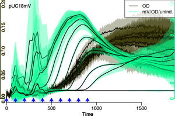

src.path <- "/home/raim/programs/platexpress/R"
for ( file in list.files(path = src.path, pattern = "*.R"))
    source(file.path(src.path,file))


<font size=3>
$$latex
\begin{equation}
  \label{apeq:monod}
  \begin{aligned}
    \frac{\text{d}X}{\text{d}t} &= \mu X\\
    \frac{\text{d}S}{\text{d}t} &= - \frac{1}{y} \mu X\\
    \frac{\text{d}f}{\text{d}t} &= k - (d+\mu)f
    %\mu &= f(S)
  \end{aligned}
\end{equation}
$$ </font>


---&twocolbigright 

### Growth vs. Gene Expression in *E. coli* - a trade-off 

***=left




***=right


<font size=3>
$$latex 
\begin{equation*} \begin{aligned}  
\frac{\text{d}X}{\text{d}t} =& \mu X\\ 
\frac{\text{d}S}{\text{d}t} =& - \frac{1}{y} \mu X\\ 
\frac{\text{d} p}{\text{d} t}  =& (k_p - \mu) p\\
\frac{\text{d} f}{\text{d} t}  =& k_f p - (d_{f} + \mu) f
\end{aligned} \end{equation*} $$
</font>

---&twocolbigright 

### Growth vs. Gene Expression in *E. coli* - a trade-off 

***=left


***=right


<font size=3>
$$latex 
\begin{equation*} \begin{aligned}  
\frac{\text{d}X}{\text{d}t} =& \mu_{ab} X\\ 
\frac{\text{d}S}{\text{d}t} =& - (\mu_{ab}+\mu_{cd}) X\\ 
\frac{\text{d}f}{\text{d} t}  =& k_f  - (d_{f} + \mu_{ab}) f\\
\frac{\text{d} atp}{\text{d} t} =& m_{cd} \mu_{cd} - m_{ab} \mu_{ab} -\\
 & m_m \mu_{m} - m_p k_p - m_f k_f p - \mu_{ab} atp\\
adp =& axp_{tot} - atp
\end{aligned} \end{equation*} $$
</font>

---&twocolbigright 

### Growth vs. Gene Expression in *S. cerevisiae* - a trade-off 

***=left


***=right


<font size=3>
$$latex 
\begin{equation*} \begin{aligned}  
\frac{\text{d}X}{\text{d}t} =& \mu_{ab} X\\ 
\frac{\text{d}S}{\text{d}t} =& - (\mu_{ab}+\mu_{cd}) X\\ 
\frac{\text{d}f}{\text{d} t}  =& k_f  - (d_{f} + \mu_{ab}) f\\
\frac{\text{d} atp}{\text{d} t} =& m_{cd} \mu_{cd} - m_{ab} \mu_{ab} -\\
 & m_m \mu_{m} - m_p k_p - m_f k_f p - \mu_{ab} atp\\
adp =& axp_{tot} - atp
\end{aligned} \end{equation*} $$
</font>


---
### Gene Expression: Normalized Fluorescence - Version 2 - after Interpolation

```{r, fig.width=12, fig.height=5}
flod <- getData(od.data,"mVenus")/od.data$OD
od.data <- addData(od.data, ID="mV/OD_2", dat=flod, col="#BB00FF99")
viewGroups(od.data, groups=groups[2], groups2=groups2,xlim=c(.01,.15),ylim=c(0,1e4),dids=c("mV/OD","mV/OD_2"),show.ci=F,lwd.orig=0, verb=F)
```
<p class=OQ>What's the difference between the two versions?</p>


The concept of "balanced growth" is flawed, yet a central assumption
of many quantitative models (e.g. Rodrigo et al. 2012).


* What did we measure?
* Which values do we need?
* What are our assumptions and are they justified?
* What is the measurement error, and where do we account for it?
