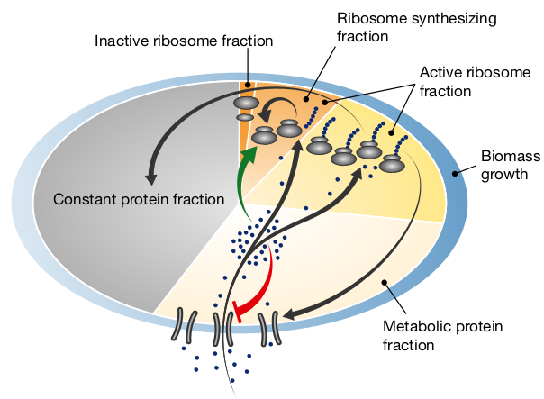

## From Data Hell to Model Heaven

### Tube cultures vs. Platereader cultures:

1. Big Data Analysis: many replicates, many conditions
2. Endpoint vs. Kinetics: steady-state vs. dynamics

### Today: Load, Inspect & Analyse Data
    
* What did we measure?
* Which values do we need?
* What are our assumptions and are they justified?
* What is the measurement error, and where do we account for it?

---

### Installing R Packages from `cran`, `bioconductor` & `github`

```{r, eval=FALSE}
install.packages(c("grofit","growthcurver")) # at CRAN

source("https://bioconductor.org/biocLite.R") # at bioconductor
biocLite("cellGrowth")

install.packages("devtools") # R development tools
library(devtools)
install_github("raim/platexpress") # at github
```


https://github.com/raim/platexpress 

<oq>Do you speak `git`? Try to install from your local copy:</oq><br/>
`git clone git@github.com:raim/platexpress.git`<br/>
... and use `R CMD build` & `sudo R CMD INSTALL`

--- .centertext

### How to use a new R package?
```{r eval=FALSE}
## load the package & explore
library(platexpress)

?platexpress # VIEW HELP FILES
vignette("platexpress") # READ THE VIGNETTE
demo("demo_ap12") # RUN THE DEMO
getData # SEE WHAT A FUNCTION DOES: just type without brackets

## APPLY TO YOUR DATA:

plate <- readPlateMap("IPTG_Testreihe_3.csv")
files <- c("20161201_20161201 Praktikum - pRAJ11  1_Absorbance.CSV",
           "20161201_20161201 Praktikum - pRAJ11  1_Fluorescence.CSV")
raw <- readPlateData(files, type="BMG")
viewPlate(raw)
```

---&twocolbigright

### Why Growth Rates? 

***=left


* Injection of IPTG into one column (7 wells + 1 blank) every
100 minutes.
* Slower response with later injections.

***=right


\( \Rightarrow \) Faster growth rate \(\mu\) with later or no induction.

---&twocolbigright

### Why Growth Rates? 

***=left


* Injection of IPTG into one column (7 wells + 1 blank) every
100 minutes.
* Slower response with later injections.

***=right


\( \Rightarrow \) Faster growth rate \(\mu\) with later or no induction.

<oq>\(\mu = k \frac{\text{ribosomes}}{\text{proteins}}\)</oq>

<div  style='text-align: left;line-height: 90%;'><font size=3> 
Schaechter, Maaloe & Kjeldgaard, J Gen Microbiol <b> 1958</b>: <em>Dependency on medium and temperature of cell size and chemical composition during <oq>balanced growth</oq> of *Salmonella typhimurium*.</em><br/>
<b>Koch, Can J Microbiol 1988: <em>Why can't a cell grow infinitely fast?</em></b></br>
Neidhardt, J Bacteriol 1999: <em>Bacterial growth: constant obsession with dN/dt.</em>
</font>

---&twocolbigright

### Why Growth Rates? 

***=left


***=right
<oq>\(\mu = k \frac{\text{ribosomes}}{\text{proteins}}\)</oq>

<div  style='text-align: left;line-height: 90%;'><font size=3> 
Brauer <em>et al.</em>, Mol Biol Cell 2008: <em>Coordination of growth rate, cell cycle, stress response, and metabolic activity in yeast.</em><br/>
Slavov <em>et al.</em>, Mol Biol Cell 2011: <em>Coupling among growth rate response, metabolic cycle, and cell division cycle in yeast.</em><br/>
Scott <em>et al.</em>, Science 2010: <em>Interdependence of cell growth and gene expression: origins and consequences.</em></br>
Wei&szlig;e <em>et al.</em>, PNAS 2015: <em>Mechanistic links between cellular trade-offs, gene expression, and growth.</em>
</font></div>

---&twocolbigright


***=left




Scott *et al.*, Mol Syst Biol 2014: *Emergence of robust growth laws from optimal regulation of ribosome synthesis.*

***=right
<br/>
<oq>Expression of large gene groups correlates with \(\mu\).</oq>

<br/>
<oq>Even at constant \(\mu\) cells are not 
in steady-state!</oq>

Slavov *et al.*, Cell Rep 2014: *Constant growth rate can be supported by decreasing energy flux and increasing aerobic glycolysis.*


--- &twocol .codefont

### Growth & Gene Expression in *E. coli* : exponential growth

*** =left


$$latex 
\begin{equation*} \begin{aligned}  
\frac{\text{d}X(t)}{\text{d}t} =& \mu X(t)\\ 
X(t) =& X(0)   e^{\mu  t}\\ 
\end{aligned} \end{equation*} $$

<oq>Can you derive the formula for exponential growth?</oq>

*** =right

```{r, fig.width=6, fig.height=4}
time <- seq(0,10,0.1) # hours
mu <- 0.3 # specific growth rate, hour^-1
x0 <- 0.01 # the inoculum: cell density, cells liter^-1
xt <- x0 * exp(mu*time)
par(mai=c(.75,.75,.1,.1),mgp=c(1.5,.5,0),cex=1.2)
plot(time, xt,
     xlab="time, h",ylab=expression(X[0]*e^(mu*t)))
```

--- &twocol .codefont

### Growth & Gene Expression in *E. coli* : growth rate

*** =left


$$latex 
\begin{equation*} \begin{aligned}  
\frac{\text{d}X(t)}{\text{d}t} =& \mu X(t)\\ 
X(t) =& X(0)   e^{\mu  t}\\ 
\ln \frac{X(t)}{X(0)} =& \mu t
\end{aligned} \end{equation*} $$

*** =right

```{r, fig.width=6, fig.height=4}
time <- seq(0,10,0.1) # hours
mu <- 0.3 # specific growth rate, hour^-1
x0 <- 0.01 # the inoculum: cell density, cells liter^-1
xt <- x0 * exp(mu*time)
par(mai=c(.75,.75,.1,.1),mgp=c(1.5,.5,0),cex=1.2)
plot(time, log(xt/x0),
     xlab="time, h",ylab=expression(ln(X(t)/X[0])))
```  

--- &twocol .codefont

### Growth & Gene Expression in *E. coli* : doubling time

*** =left


$$latex 
\begin{equation*} \begin{aligned}  
\frac{\text{d}X(t)}{\text{d}t} =& \mu X(t)\\ 
X(t) =& X(0)   e^{\mu  t}\\ 
\frac{\ln 2}{\mu} = & t_D
\end{aligned} \end{equation*} $$

*** =right

```{r, fig.width=6, fig.height=4}
time <- seq(0,10,0.1) # hours
mu <- 0.3 # specific growth rate, hour^-1
x0 <- 0.01 # the inoculum: cell density, cells liter^-1
xt <- x0 * exp(mu*time)
par(mai=c(.75,.75,.1,.1),mgp=c(1.5,.5,0),cex=1.2)
plot(time, log(xt/x0),
     xlab="time, h",ylab=expression(ln(X(t)/X[0])))
```  

--- &twocolbigright .codefont

### Growth & Gene Expression in *E. coli* : growth rate

*** =left


$$latex 
\begin{equation*} \begin{aligned}  
\frac{\text{d}X(t)}{\text{d}t} =& \mu X(t)\\ 
X(t) =& X(0)   e^{\mu  t}\\ 
\ln(X(t)) =& \mu t + \ln(X(0))
\end{aligned} \end{equation*} $$

*** =right

```{r, fig.width=6, fig.height=4, echo=TRUE}
par(mai=c(.75,.75,.1,.1),mgp=c(1.5,.5,0),cex=1.2)
plot(time, log(xt), xlab="time, h",ylab=expression(ln~X(t)))
x1 <- .05; idx1 <- which(abs(xt-x1)==min(abs(xt-x1)))
x2 <- .1; idx2 <- which(abs(xt-x2)==min(abs(xt-x2)))
lines(x=time[c(idx1,idx2)], y=log(xt[c(idx1,idx1)]),col=2,lwd=5)
text(time[idx2],mean(log(xt[c(idx1,idx2)])),expression(Delta~X),pos=4,col=2)
lines(x=time[c(idx2,idx2)], y=log(xt[c(idx1,idx2)]),col=2,lwd=5)
text(mean(time[c(idx1,idx2)]),log(xt[idx1]),expression(Delta~t),pos=1,col=2)
arrows(x0=0,x1=0,y0=log(xt[1]),y1=-1.4,col=2,lwd=5);
text(x=0,y=-3,expression(ln(X(0))),pos=4,col=2)
```  


---.codefont
### Load Your Data
```{r, fig.width=6, fig.height=4}
library(platexpress)

setwd("~/work/hhu_2015/uebung_201612/cellgrowth_20161214/ecoli_ts_20161014")

plate <-readPlateMap("20161014_platemap.csv",fsep=";",
                     fields=c("strain","IPTG","blank"))
files <- c("20161014_20161014 IPTG mVenus Injection  1_Absorbance.CSV",
           "20161014_20161014 IPTG mVenus Injection  1_Fluorescence.CSV")
raw <- readPlateData(files,type="BMG",time.conversion=1/60)
```

<oq> What does the `warning` mean?<oq/>

---
```{r, fig.width=12, fig.height=6.5}
viewPlate(raw)
```

---
```{r, fig.width=6, fig.height=4}
showSpectrum() # try: findWavelength(3)
## re-name and color data
raw <- prettyData(raw, dids=c(OD="584",mVenus="485/Em520"),
                  colors=c("#000000",wavelength2RGB(600)))
```

---
```{r, fig.width=12, fig.height=6.5}
vp <- viewPlate(raw,xlim=c(0,1800),xscale=TRUE)
```

---
```{r, fig.width=10, fig.height=6}

## GET A SINGLE DATASET
od <- getData(raw,"OD") # what is `od` ?
TIME <- raw$Time        # what does the $ do?
Xt <- od[,"A8"]
plot(TIME, Xt)
```

---
```{r, fig.width=10, fig.height=4.5}
## cut to growth range
rng <- TIME<1500   # what is `rng` ?
Xt <- Xt[rng]
TIME <- TIME[rng]

## look at data
par(mfcol=c(1,2), mai=c(.75,.75,.1,.1), mgp=c(1.5,.5,0), cex=1.2)
plot(TIME, Xt)
plot(TIME, log(Xt)) # log it - default `log` in R is the natural logarithm, ln
```

---
```{r, fig.width=10, fig.height=4.5}
## cut to linear range of growth
rng <- TIME>600 & TIME < 900
xt <- Xt[rng]
time <- TIME[rng]

## look again at data
par(mfcol=c(1,2))
plot(time, xt)
plot(time, log(xt))
```

---.codefont

```{r}
## DO LINEAR REGRESSION
## ln(X(t)) = mu * t + ln(X(0))
lfit <- lm(log(xt) ~ time) # what is `~` ?

## check quality of fit
summary(lfit)
```

---
```{r, fig.width=5, fig.height=4.5}
## get parameters from linear regression
x0.1 <- exp(coefficients(lfit)[1]) # e^ln(X(0)) = ?
mu.1 <- coefficients(lfit)[2] # mu

## plot
par(mai=c(.75,.75,.1,.1),mgp=c(1.5,.5,0),cex=1.2)
plot(TIME,log(Xt))
lines(TIME, mu.1*TIME + log(x0.1), col="red")

```

---.codefont
```{r}
## DO NON-LINEAR REGRESSION, using
## the results of the linear fit as initial parameter guesses
dat <- data.frame(time=time, xt=xt)
start <- list(mu=mu.1,x0=x0.1)
nlfit <- nls(xt ~ x0*exp(mu*time),data=dat,start=start) # TRY MORE COMPLEX MODELS, see a few slides ahead

## check quality of fit
summary(nlfit)
```

---.codefont
```{r, fig.width=10, fig.height=4.5}
## get parameters & plot results
mu.2 <- coefficients(nlfit)[1]
x0.2 <- coefficients(nlfit)[2]
par(mfcol=c(1,2),mai=c(.75,.75,.1,.1),mgp=c(1.5,.5,0),cex=1.2)
plot(TIME,Xt,ylim=c(0.2,.4))
lines(TIME, x0.2 * exp(TIME*mu.2),col="green", lty=2,lwd=5)
lines(TIME, x0.1 * exp(TIME*mu.1),col="red",lwd=2)
legend("bottomright",legend=c("data","lin.reg.","non-lin."),
       col=c(1,2,3),pch=c(1,NA,NA),lty=c(NA,1,2),lwd=3)
plot(TIME, x0.2 * exp(TIME*mu.2),col="green", lty=2,lwd=5)
points(TIME,Xt)
lines(TIME, x0.1 * exp(TIME*mu.1),col="red",lwd=2)
```


---&twocol

### Fitting Growth Models

***=left


* Initial Cell Density: \(X(0) \)
* Lag Phase: \(\lambda \)
* Exponential Phase: growth rate \(\mu \)
* Stationary Phase: *capacity* \(A \) 

***=right

* Logistic Equation:<br/>
\(X(t) = \frac{A}{1+e^{\frac{4 \mu}{A}(\lambda - t)+1)}} \)
* Gompertz:<br/>
\(X(t) = A e^{-e^{\frac{\mu e}{A}(\lambda -t)+1}} \)
* Modified Gompertz:<br/>
\(X(t) = A e^{-e^{\frac{\mu e}{A}(\lambda -t)+1}} + A e^{\alpha(t-t_{shift})} \)
* Richard's generalized logistic model:<br/> \(  X(t) = A (1 + \nu e^{1+ \nu + \frac{\mu}{A}(1+\nu )^{1+\frac{1}{\nu}}(\lambda -t)})^{-\frac{1}{\nu}} \)

as implemented in R package `grofit`

<oq> Try these equations with `nls`.<p/>

---
### Prepare Data: blanks, cuts, etc.

```{r, eval=TRUE}
raw2 <- cutData(raw, rng=c(0,1550), mid="Time")
raw3 <- correctBlanks(raw2, plate,dids="OD",max.mid=1500) 
raw4 <- correctBlanks(raw3,plate,dids="mVenus",by=c("strain","IPTG"),
                      mbins=length(raw$Time)/5,verb=FALSE)
data <- adjustBase(raw4, base=0, add.fraction=.001, 
                   wells=unlist(groups),xlim=c(1,which(raw$Time>1500)[1]),
				   each=TRUE, verb=FALSE) # set verb to TRUE
```
<oq> What happens in `correctBlanks` and `cutData`? <br/>
What does `adjustBase` do, and when could we need it?<p/>

---
### Get Replicate Groups

```{r, fig.width=12, fig.height=4}
groups <- getGroups(plate, c("strain"), verb=FALSE) # SET TO TRUE!
groups2 <- getGroups(plate, c("strain","IPTG"), verb=FALSE) 
viewGroups(data, groups=groups, groups2=groups2, verb=FALSE)
```

<oq> What are the lines and areas?<br/>
What is the structure of the `groups` item? 
Can you make your own groupings?<br/>
Try different groupings and parameters to `viewGroups`.</oq>

---
### Use Package `grofit` to Fit Growth Data

```{r, eval=TRUE}
raw2 <- cutData(raw,rng=c(200,1500))
grodat <- data2grofit(raw2, did="OD", plate=plate, 
                      wells=groups[["pUC18mV"]])
library(grofit)
fitparams <- grofit.2.control(interactive=FALSE, plot=TRUE) # SET ALL TO TRUE!!
pdf("growthrates.pdf")
fits <- gcFit.2(time=grodat$time, data=grodat$data, control=fitparams)
dev.off()
```

---
### Use Package `grofit` to Fit Growth Data

```{r, fig.width=7, fig.height=5}
table <- grofitGetParameters(fits, p=c("AddId","mu.spline"))
boxplot(table[,"mu.spline"] ~ table[,"AddId"], las=2, ylim=c(1.9e-4,5e-4))
```

<oq> 
Try different well groups instead of `table[,"AddId"]`.<br/>
Are the fits Ok? How to get more information on the fits?</oq>

---&twocol

***=left
### Gene Expression

* Measured: total fluorescence per well
* Wanted: protein level per cell!

Assumptions:

1. Fluorescence is linear with protein level
2. OD is linear with cell number

<oq>\( \Rightarrow \) Fluor./OD  &Tilde; proteins/cell</oq>

***=right


---
### Gene Expression: Normalized Fluorescence - FL/OD

```{r, fig.width=12, fig.height=5}
viewGroups(data, groups=groups, groups2=groups2, xid="OD", lwd.orig=.5, verb=FALSE)
```

---
### Gene Expression: Normalized Fluorescence  - FL/OD

```{r, fig.width=12, fig.height=5}
fl <- getData(data,"mVenus")
od <- getData(data,"OD")
data <- addData(data, ID="mV/OD", dat=fl/od, col="#0095FF")
viewGroups(data, groups=groups, groups2=groups2, 
           dids=c("OD","mV/OD"),ylims=list("mV/OD"=c(0,1e4)),emphasize.mean=T,verb=F)
```

---
### Gene Expression: Normalized Fluorescence - FL/OD

```{r, fig.width=12, fig.height=5}
viewGroups(data, groups=groups, groups2=groups2, dids="mV/OD", xid="OD", lwd.orig=.5, 
           ylim=c(0,1e4), g2.legend=FALSE, verb=FALSE)
```

<oq>What could the slope \(\frac{mV}{OD} \sim OD \) (where it's linear) 
mean?<br/>Can we use it?</oq>

---
### Gene Expression: Normalized Fluorescence - Interpolate to OD

```{r, fig.width=12, fig.height=5}
od.data <- interpolatePlateData(data,"OD")
viewGroups(od.data, groups=groups[2], groups2=groups2,xlim=c(.01,.15),
           ylims=list("mV/OD"=c(0,1e4)),dids="mV/OD", show.ci=F,lwd.orig=0, verb=F)
```

---
### Gene Expression: The Fold Change

```{r, fig.width=12, fig.height=5, echo=1:3}
flod <- getData(od.data,"mV/OD")
uninduced <- rowMeans(flod[, groups2[["pUC18mV_Inj:NA"]]],na.rm=TRUE)
od.data <- addData(od.data, ID="mV/OD/uninduced", dat=flod/uninduced, col="#AAAA00")
viewGroups(od.data, groups=groups[2], groups2=groups2,xlim=c(.01,.15),dids=c("mV/OD/uninduced"),show.ci=F,lwd.orig=0, verb=F, ylim=c(0,15))
```

---
### Gene Expression: Data Normalization

```{r, fig.width=11, fig.height=3.3, echo=FALSE, results="hide"}
par(mfcol=c(1,2),mai=c(.8,.75,.1,.1))
viewGroups(data, groups=groups[2], groups2=groups2, ylims=list("mV/OD"=c(0,1e4)),embed=TRUE,no.par=TRUE,g2.legend=FALSE,yaxis=2:3)
viewGroups(od.data, groups=groups[2], groups2=groups2,xlim=c(.01,.15),
           ylims=list("mV/OD"=c(0,7e3)),dids="mV/OD", show.ci=F,lwd.orig=0, verb=F,embed=TRUE,no.par=TRUE,g2.legend=FALSE)
```
```{r, fig.width=11, fig.height=3.3, echo=FALSE, results="hide"}
flod <- getData(data,"mV/OD")
uninduced <- rowMeans(flod[, groups2[["pUC18mV_Inj:NA"]]],na.rm=TRUE)
data <- addData(data, ID="mV/OD/uninduced", dat=flod/uninduced, col="#AA0000")
par(mfcol=c(1,2),mai=c(.8,.75,.1,.1))
viewGroups(data, groups=groups[2], groups2=groups2,dids=c("OD","mV/OD/uninduced"),show.ci=T,lwd.orig=0, verb=F, ylims=list("mV/OD/uninduced"=c(0,12)),embed=TRUE,no.par=TRUE,g2.legend=FALSE)
viewGroups(od.data, groups=groups[2], groups2=groups2,xlim=c(.01,.15),dids=c("mV/OD/uninduced"),show.ci=F,lwd.orig=0, verb=F, ylim=c(0,15),embed=TRUE,no.par=TRUE,g2.legend=FALSE)
```

<oq>What's wrong with `mV/OD/uninduced` vs. `time` w/o interpolation?</oq>


---
### Gene Expression: Normalized Fluorescence - Result

```{r, fig.width=12, fig.height=4}
results <- boxData(od.data, did="mV/OD/uninduced", rng=.08, groups=groups2, type="bar")
```

Extracts values in given range; plots by groups, and returns
values for each well. 

<oq>What are the error bars?<br/>
See ?cutData on how to obtain values in 
a given range directly.<br/>Or try yourself with base R.</oq>

---
### Gene Expression: Normalized Fluorescence - Result

```{r, fig.width=12, fig.height=5}
library(platexpress)
head(results)
```
<oq>Calculate confidence intervals and error bars yourself.</oq>

---.codefont

```{r, fig.width=8, fig.height=5}
imgtxt <- matrix(results[,1], nrow=7, ncol=12) # MATRIX THAT LOOKS LIKE PLATE
imgdat <- matrix(results[,3], nrow=7, ncol=12)
tmp <- t(apply(imgdat, 2, rev)) # WHAT HAPPENS HERE?
par(mai=c(.5,.5,.01,.01))
image(x=1:12, y=1:7, z=log(tmp), axes=FALSE, ylab=NA, xlab=NA)
text(x=rep(1:12,7), y=rep(7:1,each=12), paste(t(imgtxt),":\n",t(round(imgdat,2)))) 
axis(1,at=1:12); axis(2, at=1:7, labels=toupper(letters[7:1]), las=2)
```

<oq>In which order does `image` plot rows and columns of a matrix?</oq><br/> 
<oq>Can you spot any systematic plate effects?</oq>

<br/><br/>hide:
pixels in the first row, from left to right,<br/> 
correspond to the first column in the matrix, bottom up

---
### Gene Expression - Summary

1. Growth rate \( \mu \) matters!
1. Fluorescence per OD as a measure of proteins per cell.
3. Interpolate data to a common OD.
    * Note noise accumulation!
4. Calculate fold-ratio to control.
    * Be careful; what is your control?
4. Get data at a given OD, or search maximum, etc.

<oq>What other measures would be interesting or could be
required for a quantitative model?</oq>

---.centertext
## From Wells to Cells

### Conversion of Carbon&Energy Source S to biomass X:

<br/>
S \(\rightarrow\) y X + (1-y) P

### Catalyzed by X:

$$latex
\begin{equation}
  \label{apeq:monod}
  \begin{aligned}
    \frac{\text{d}X}{\text{d}t} &= \mu X\\
    \frac{\text{d}S}{\text{d}t} &= - \frac{1}{y} \mu X \\
    \mu & =\mu_{max}\frac{S}{S+K}
    %\mu &= f(S)
  \end{aligned}
\end{equation}
$$


<br/>
<oq>How can we estimate the yield \(y\) ?</oq>

---.codefont
## From Wells to Cells

### Fluorescent Protein F, total culture concentration:
$$latex
\begin{equation}
  \label{eq:Protein}
  \begin{aligned}
%  \frac{\text{d} F}{\text{d} t} = k X V_c - d F
    \frac{\text{d}X}{\text{d}t} &= \mu X\\
  \frac{\text{d} F}{\text{d} t} &= K(?) - d F
  \end{aligned}
\end{equation}
$$

### Intracellular concentration:

$$latex
\begin{equation}
f = \frac{F}{X V_c}
\end{equation}
$$

<br/> <oq>What is \(K\) ?</br>How can we map \(F\) from total culture
to intracellular concentration \(f\) ?<br/> Calculate \(\frac{\text{d}
f}{\text{d} t}\).</oq>

---.codefont
## From Wells to Cells

$$latex
\begin{equation}
  \begin{aligned}
    f =& \frac{F}{X V_c} \;;\; v_f=X V_c\\
    \dot{f} =& \dot{F}\frac{1}{X V_c} - \dot{X}\frac{F}{X}\frac{1}{X V_c}\\
            =& \dot{F}\frac{1}{v_f} - \dot{X}\frac{F}{X}\frac{1}{v_f}\\
            =& (K - d\,f\,v_f)\frac{1}{v_f} - \mu X \frac{f v_f}{X} \frac{1}{v_f}\\
            =& \frac{K}{v_f} - d\,f - \mu\,f\\
            =& \frac{K}{v_f} - (d+\mu)f\\
          K =& \frac{k}{X V_c}
  \end{aligned}
\end{equation}
$$


---.codefont
## From Wells to Cells

$$latex
\begin{equation}
  \label{apeq:wellmodel}
  \begin{aligned}
    \frac{\text{d}X}{\text{d}t} &= \mu X\\
    \frac{\text{d}S}{\text{d}t} &= - \frac{1}{y} \mu X\\
    \frac{\text{d}f}{\text{d}t} &= k - (d+\mu)f
  \end{aligned}
\end{equation}
$$

 
* <oq>Add activation of $f$ production by an inducer and
modulation by a riboswitch $r$.</oq>
* <oq>Add expression of both from a plasmid
(which itself increases exponentially within cells), where the plasmid
copy number $p$ can be accounted for</oq>. 
* <oq>And how can we account for
the effect of induced gene expression on growth rate?</oq>
