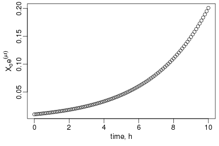
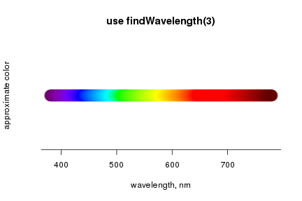
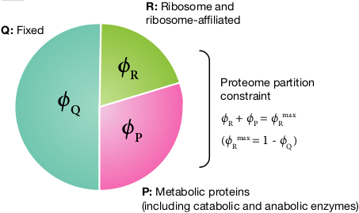
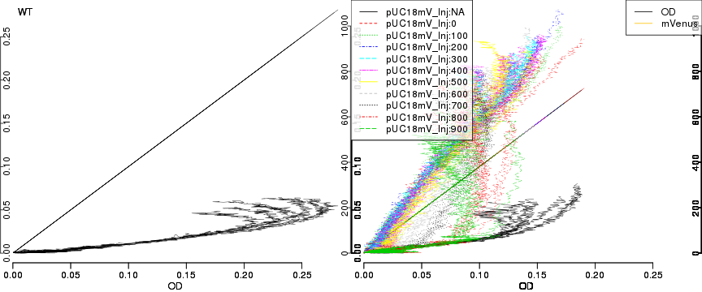
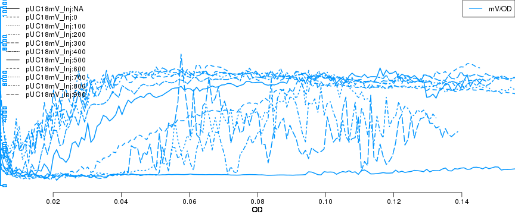

### Installing R Packages from `cran`, `bioconductor` & `github`


```r
install.packages(c("grofit","growthcurver")) # at CRAN

source("https://bioconductor.org/biocLite.R") # at bioconductor
biocLite("cellGrowth")

install.packages("devtools") # R development tools
library(devtools)
#install_github("raim/platexpress") # at github
```


https://github.com/raim/platexpress 

--- .centertext

### How to use a new R package?

```r
## load the package & explore
library(platexpress)

?platexpress # VIEW HELP FILES
vignette("platexpress") # READ THE VIGNETTE
demo("demo_ap12") # RUN THE DEMO
getData # SEE WHAT A FUNCTION DOES: just type without brackets

## APPLY TO YOUR DATA:

plate <- readPlateMap("IPTG_Testreihe_3.csv")
files <- c("20161201_20161201 Praktikum - pRAJ11  1_Absorbance.CSV",
           "20161201_20161201 Praktikum - pRAJ11  1_Fluorescence.CSV")
raw <- readPlateData(files, type="BMG")
viewPlate(raw)
```

--- &twocol .codefont

### Growth & Gene Expression in *E. coli* : exponential growth

*** =left


$$latex 
\begin{equation*} \begin{aligned}  
\frac{\text{d}X(t)}{\text{d}t} =& \mu X(t)\\ 
X(t) =& X(0)   e^{\mu  t}\\ 
\end{aligned} \end{equation*} $$

*** =right


```r
time <- seq(0,10,0.1) # hours
mu <- 0.3 # specific growth rate, hour^-1
x0 <- 0.01 # the inoculum: cell density, cells liter^-1
xt <- x0 * exp(mu*time)
par(mai=c(.75,.75,.1,.1),mgp=c(1.5,.5,0),cex=1.2)
plot(time, xt,
     xlab="time, h",ylab=expression(X[0]*e^(mu*t)))
```



--- &twocol .codefont

### Growth & Gene Expression in *E. coli* : growth rate

*** =left


$$latex 
\begin{equation*} \begin{aligned}  
\frac{\text{d}X(t)}{\text{d}t} =& \mu X(t)\\ 
X(t) =& X(0)   e^{\mu  t}\\ 
\ln \frac{X(t)}{X(0)} =& \mu t
\end{aligned} \end{equation*} $$

*** =right


```r
time <- seq(0,10,0.1) # hours
mu <- 0.3 # specific growth rate, hour^-1
x0 <- 0.01 # the inoculum: cell density, cells liter^-1
xt <- x0 * exp(mu*time)
par(mai=c(.75,.75,.1,.1),mgp=c(1.5,.5,0),cex=1.2)
plot(time, log(xt/x0),
     xlab="time, h",ylab=expression(ln(X(t)/X[0])))
```


--- &twocol .codefont

### Growth & Gene Expression in *E. coli* : doubling time

*** =left


$$latex 
\begin{equation*} \begin{aligned}  
\frac{\text{d}X(t)}{\text{d}t} =& \mu X(t)\\ 
X(t) =& X(0)   e^{\mu  t}\\ 
\frac{\ln 2}{\mu} = & t_D
\end{aligned} \end{equation*} $$

*** =right


```r
time <- seq(0,10,0.1) # hours
mu <- 0.3 # specific growth rate, hour^-1
x0 <- 0.01 # the inoculum: cell density, cells liter^-1
xt <- x0 * exp(mu*time)
par(mai=c(.75,.75,.1,.1),mgp=c(1.5,.5,0),cex=1.2)
plot(time, log(xt/x0),
     xlab="time, h",ylab=expression(ln(X(t)/X[0])))
```


--- &twocolbigright .codefont

### Growth & Gene Expression in *E. coli* : growth rate

*** =left


$$latex 
\begin{equation*} \begin{aligned}  
\frac{\text{d}X(t)}{\text{d}t} =& \mu X(t)\\ 
X(t) =& X(0)   e^{\mu  t}\\ 
\ln(X(t)) =& \mu t + \ln(X(0))
\end{aligned} \end{equation*} $$

*** =right


```r
par(mai=c(.75,.75,.1,.1),mgp=c(1.5,.5,0),cex=1.2)
plot(time, log(xt), xlab="time, h",ylab=expression(ln(X(t)/X[0])))
x1 <- .05; idx1 <- which(abs(xt-x1)==min(abs(xt-x1)))
x2 <- .1; idx2 <- which(abs(xt-x2)==min(abs(xt-x2)))
lines(x=time[c(idx1,idx2)], y=log(xt[c(idx1,idx1)]),col=2,lwd=5)
text(time[idx2],mean(log(xt[c(idx1,idx2)])),expression(Delta~X),pos=4,col=2)
lines(x=time[c(idx2,idx2)], y=log(xt[c(idx1,idx2)]),col=2,lwd=5)
text(mean(time[c(idx1,idx2)]),log(xt[idx1]),expression(Delta~t),pos=1,col=2)
lines(x=c(0,0),y=c(0,log(xt[1])),col=2,lwd=5);
text(x=0,y=-2.5,expression(ln(X(0))),pos=4,col=2)
```


---.codefont


```r
library(platexpress)
## during development, we load the latest source code:
src.path <- "/home/raim/programs/platexpress/R"
for ( file in list.files(path = src.path, pattern = "*.R"))
    source(file.path(src.path,file))

setwd("~/work/CoilProject/experiments/plategrowth/ecoli_ts_20161014")

plate <-readPlateMap("20161014_platemap.csv",fsep=";",
                     fields=c("strain","IPTG","blank"))
files <- c("20161014_20161014 IPTG mVenus Injection  1_Absorbance.CSV",
           "20161014_20161014 IPTG mVenus Injection  1_Fluorescence.CSV")
raw <- readPlateData(files,type="BMG",time.conversion=1/60)
```

```
## Parsing file 20161014_20161014 IPTG mVenus Injection  1_Absorbance.CSV 
## 	found data 584 
## Parsing file 20161014_20161014 IPTG mVenus Injection  1_Fluorescence.CSV 
## 	found data 485/Em520 
## Interpolating all data to a single master time.
```

```
## Warning in listAverage(data, "time"): time : max. SD within timepoint is 70.5 % of median difference between time points.
```

<p class="OQ"> What does the warning mean?<p/>

---

```r
viewPlate(raw)
```

```
## x-axis: Time 
## plotting 584;485/Em520
```



---

```r
showSpectrum() #findWavelength(3)
```


```r
## re-name and color data
raw <- prettyData(raw, dids=c(OD="584",mVenus="485/Em520"),
                  colors=c("#000000",wavelength2RGB(600)))
```

---

```r
vp <- viewPlate(raw,xlim=c(0,1800),xscale=TRUE)
```

```
## x-axis: Time 
## plotting OD;mVenus
```


---

```r
## GET A SINGLE DATASET
od <- getData(raw,"OD")
TIME <- raw$Time
Xt <- od[,"A8"]
plot(TIME, Xt)
```


---

```r
## cut to growth range
rng <- TIME<1500
Xt <- Xt[rng]
TIME <- TIME[rng]

## look at data
par(mfcol=c(1,2),mai=c(.75,.75,.1,.1),mgp=c(1.5,.5,0),cex=1.2)
plot(TIME, Xt)
plot(TIME, log(Xt)) # log it
```


---

```r
## cut to linear range of growth
rng <- TIME>600 & TIME < 900
xt <- Xt[rng]
time <- TIME[rng]

## look again at data
par(mfcol=c(1,2))
plot(time,xt)
plot(time,log(xt))
```


---.codefont


```r
## DO LINEAR REGRESSION
## ln(X(t)) = mu * t + ln(X(0))
lfit <- lm(log(xt) ~ time)

## check quality of fit
summary(lfit)
```

```
## 
## Call:
## lm(formula = log(xt) ~ time)
## 
## Residuals:
##       Min        1Q    Median        3Q       Max 
## -0.021694 -0.006298 -0.001451  0.006707  0.023853 
## 
## Coefficients:
##               Estimate Std. Error t value Pr(>|t|)    
## (Intercept) -1.840e+00  1.122e-02  -164.0   <2e-16 ***
## time         7.663e-04  1.488e-05    51.5   <2e-16 ***
## ---
## Signif. codes:  0 '***' 0.001 '**' 0.01 '*' 0.05 '.' 0.1 ' ' 1
## 
## Residual standard error: 0.01001 on 58 degrees of freedom
## Multiple R-squared:  0.9786,	Adjusted R-squared:  0.9782 
## F-statistic:  2652 on 1 and 58 DF,  p-value: < 2.2e-16
```

---

```r
## get parameters from linear regression
x0.1 <- exp(coefficients(lfit)[1]) # ln(X(0))
mu.1 <- coefficients(lfit)[2] # mu

## plot
par(mai=c(.75,.75,.1,.1),mgp=c(1.5,.5,0),cex=1.2)
plot(TIME,log(Xt))
lines(TIME, mu.1*TIME + log(x0.1), col="red")
```


---.codefont

```r
## DO NON-LINEAR REGRESSION, using
## the results of the linear fit as initial parameter guesses
dat <- data.frame(time=time, xt=xt)
start <- list(mu=mu.1,x0=x0.1)
nlfit <- nls(xt ~ x0*exp(mu*time),data=dat,start=start)

## check quality of fit
summary(nlfit)
```

```
## 
## Formula: xt ~ x0 * exp(mu * time)
## 
## Parameters:
##     Estimate Std. Error t value Pr(>|t|)    
## mu 7.660e-04  1.474e-05   51.99   <2e-16 ***
## x0 1.588e-01  1.792e-03   88.63   <2e-16 ***
## ---
## Signif. codes:  0 '***' 0.001 '**' 0.01 '*' 0.05 '.' 0.1 ' ' 1
## 
## Residual standard error: 0.002792 on 58 degrees of freedom
## 
## Number of iterations to convergence: 1 
## Achieved convergence tolerance: 2.422e-06
```

---.codefont

```r
## get parameters & plot results
mu.2 <- coefficients(nlfit)[1]
x0.2 <- coefficients(nlfit)[2]
par(mfcol=c(1,2),mai=c(.75,.75,.1,.1),mgp=c(1.5,.5,0),cex=1.2)
plot(TIME,Xt,ylim=c(0.2,.4))
lines(TIME, x0.2 * exp(TIME*mu.2),col="green", lty=2,lwd=5)
lines(TIME, x0.1 * exp(TIME*mu.1),col="red",lwd=2)
legend("bottomright",legend=c("data","lin.reg.","non-lin."),
       col=c(1,2,3),pch=c(1,NA,NA),lty=c(NA,1,2),lwd=3)
plot(TIME, x0.2 * exp(TIME*mu.2),col="green", lty=2,lwd=5)
points(TIME,Xt)
lines(TIME, x0.1 * exp(TIME*mu.1),col="red",lwd=2)
```


---&twocolbigright

### Growth vs. Gene Expression in *E. coli* - a trade-off 

***=left


* Injection of IPTG into one column (7 wells + 1 blank) every
100 minutes.
* Slower response with later injections.

***=right


\( \Rightarrow \) Faster growth rates with later or no induction.

---&twocolbigright

### Growth vs. Gene Expression in *E. coli* - a trade-off 

***=left


* Injection of IPTG into one column (7 wells + 1 blank) every
100 minutes.
* Slower response with later injections.

***=right


\( \Rightarrow \) Faster growth rates with later or no induction.

\(\mu = k \frac{\text{ribosomes}}{\text{proteins}}\)

<div  style='text-align: left;line-height: 90%;'><font size=3> 
<b>Koch, Can J Microbiol 1988: <em>Why can't a cell grow infinitely fast?</em></b><br/>
Schaechter, Maaloe & Kjeldgaard, J Gen Microbiol: <em>Dependency on medium and temperature of cell size and chemical composition during balanced growth of *Salmonella typhimurium*.</em>
</font>

---&twocolbigright

### Growth vs. Gene Expression in *E. coli* - a trade-off 

***=left





***=right
\(\mu = k \frac{\text{ribosomes}}{\text{proteins}}\)

<div  style='text-align: left;line-height: 90%;'><font size=3> 
<b>Koch, Can J Microbiol 1988: <em>Why can't a cell grow infinitely fast?</em></b><br/>
Brauer <em>et al.</em>, Mol Biol Cell 2008: <em>Coordination of growth rate, cell cycle, stress response, and metabolic activity in yeast.</em><br/>
Slavov <em>et al.</em>, Mol Biol Cell 2011: <em>Coupling among growth rate response, metabolic cycle, and cell division cycle in yeast.</em><br/>
Scott <em>et al.</em>, Science 2010: <em>Interdependence of cell growth and gene expression: origins and consequences.</em></br>
Wei&szlig;e <em>et al.</em>, PNAS 2015: <em>Mechanistic links between cellular trade-offs, gene expression, and growth.</em>
</font></div>

---&twocol

### Fitting Growth Models

***=left


* Initial Cell Density: \(X(0) \)
* Lag Phase: \(\lambda \)
* Exponential Phase: growth rate \(\mu \)
* Stationary Phase: *capacity* \(A \) 

***=right

* Logistic Equation:<br/>
\(X(t) = \frac{A}{1+e^{\frac{4 \mu}{A}(\lambda - t)+1)}} \)
* Gompertz:<br/>
\(X(t) = A e^{-e^{\frac{\mu e}{A}(\lambda -t)+1}} \)
* Modified Gompertz:<br/>
\(X(t) = A e^{-e^{\frac{\mu e}{A}(\lambda -t)+1}} + A e^{\alpha(t-t_{shift})} \)
* Richard's generalized logistic model:<br/> \(  X(t) = A (1 + \nu e^{1+ \nu + \frac{\mu}{A}(1+\nu )^{1+\frac{1}{\nu}}(\lambda -t)})^{-\frac{1}{\nu}} \)

as implemented in R package `grofit`

<p class="OQ"> Try these equations with `nls`.<p/>

---
### Prepare Data, get Replicate Groups


```r
raw2 <- correctBlanks(raw, plate,dids="OD",max.mid=1500) 
```

```
## blanking OD 
## blanking TRUE : 84 wells, using 12 blank wells
## OD 
## 	time bin: 1 1 - 552	skipping 253 bins at 1500 
## 	blank: 0.242106481072471
```

```r
raw3 <- correctBlanks(raw2,plate,dids="mVenus",by=c("strain","IPTG"),
                      mbins=length(raw$Time)/5) #,verb=FALSE)
```

```
## blanking mVenus 
## blanking _WT_Inj:NA : 7 wells, using 1 blank wells
## mVenus 
## 	time bin: 1 1 - 6	blank: 55.2892698507607 
## 	time bin: 2 6 - 11	blank: 54.0631472784741 
## 	time bin: 3 11 - 16	blank: 51.6228899051324 
## 	time bin: 4 16 - 21	blank: 50.0629846918729 
## 	time bin: 5 21 - 26	blank: 49.1248864187608 
## 	time bin: 6 26 - 31	blank: 46.4857561184495 
## 	time bin: 7 31 - 36	blank: 45.940891843223 
## 	time bin: 8 36 - 41	blank: 44.810889353777 
## 	time bin: 9 41 - 46	blank: 44.4769531736692 
## 	time bin: 10 46 - 51	blank: 44.0439825332275 
## 	time bin: 11 51 - 56	blank: 43.3772320887126 
## 	time bin: 12 56 - 61	blank: 42.0865112698539 
## 	time bin: 13 61 - 66	blank: 42.8087471983111 
## 	time bin: 14 66 - 71	blank: 42.4771718803514 
## 	time bin: 15 71 - 76	blank: 42.9257862785917 
## 	time bin: 16 76 - 81	blank: 42.4048676151198 
## 	time bin: 17 81 - 86	blank: 42.3356649695228 
## 	time bin: 18 86 - 91	blank: 42.0435554017348 
## 	time bin: 19 91 - 96	blank: 40.3993997219686 
## 	time bin: 20 96 - 101	blank: 40.8511121394162 
## 	time bin: 21 101 - 106	blank: 40.7913075710865 
## 	time bin: 22 106 - 111	blank: 40.1346540581926 
## 	time bin: 23 111 - 116	blank: 40.5833300353002 
## 	time bin: 24 116 - 121	blank: 39.8501445438153 
## 	time bin: 25 121 - 126	blank: 39.9243059692589 
## 	time bin: 26 126 - 131	blank: 39.6220037722056 
## 	time bin: 27 131 - 136	blank: 40.3357116520368 
## 	time bin: 28 136 - 141	blank: 39.7914553422338 
## 	time bin: 29 141 - 146	blank: 39.3759498698321 
## 	time bin: 30 146 - 151	blank: 39.0613649347912 
## 	time bin: 31 151 - 156	blank: 38.8008830745095 
## 	time bin: 32 156 - 161	blank: 39.336980837083 
## 	time bin: 33 161 - 166	blank: 39.4048470803486 
## 	time bin: 34 166 - 171	blank: 39.1253668283511 
## 	time bin: 35 171 - 176	blank: 38.3770463330766 
## 	time bin: 36 176 - 181	blank: 38.0616562848462 
## 	time bin: 37 181 - 186	blank: 38.6213934673272 
## 	time bin: 38 186 - 191	blank: 39.1241847994121 
## 	time bin: 39 191 - 196	blank: 39.4082705682582 
## 	time bin: 40 196 - 201	blank: 38.3360866006964 
## 	time bin: 41 201 - 206	blank: 38.7514887521614 
## 	time bin: 42 206 - 211	blank: 38.8378095892747 
## 	time bin: 43 211 - 216	blank: 38.3846669158525 
## 	time bin: 44 216 - 221	blank: 38.1625337077527 
## 	time bin: 45 221 - 226	blank: 38.5117229278647 
## 	time bin: 46 226 - 231	blank: 38.360240466057 
## 	time bin: 47 231 - 236	blank: 38.4271002054422 
## 	time bin: 48 236 - 241	blank: 37.7556105700679 
## 	time bin: 49 241 - 246	blank: 37.6568811990619 
## 	time bin: 50 246 - 251	blank: 38.2546019301328 
## 	time bin: 51 251 - 256	blank: 38.4816414269647 
## 	time bin: 52 256 - 261	blank: 38.320785843223 
## 	time bin: 53 261 - 266	blank: 38.0946664656964 
## 	time bin: 54 266 - 271	blank: 38.2107600755423 
## 	time bin: 55 271 - 276	blank: 38.1211243156613 
## 	time bin: 56 276 - 281	blank: 38.0001691566945 
## 	time bin: 57 281 - 286	blank: 38.7256909827847 
## 	time bin: 58 286 - 291	blank: 38.0563429142271 
## 	time bin: 59 291 - 296	blank: 37.8895658799369 
## 	time bin: 60 296 - 301	blank: 37.9966290476623 
## 	time bin: 61 301 - 306	blank: 38.231243620042 
## 	time bin: 62 306 - 311	blank: 38.1316385377281 
## 	time bin: 63 311 - 316	blank: 38.0440406032779 
## 	time bin: 64 316 - 321	blank: 37.9912999041598 
## 	time bin: 65 321 - 326	blank: 38.352742806206 
## 	time bin: 66 326 - 331	blank: 37.8482447969296 
## 	time bin: 67 331 - 336	blank: 38.2288135424449 
## 	time bin: 68 336 - 341	blank: 38.705795365312 
## 	time bin: 69 341 - 346	blank: 39.2827522249317 
## 	time bin: 70 346 - 351	blank: 38.3613064007208 
## 	time bin: 71 351 - 356	blank: 38.5688548983631 
## 	time bin: 72 356 - 361	blank: 38.5632211453112 
## 	time bin: 73 361 - 366	blank: 38.7785621888211 
## 	time bin: 74 366 - 371	blank: 38.5847361039337 
## 	time bin: 75 371 - 376	blank: 38.6934569892904 
## 	time bin: 76 376 - 381	blank: 38.7128785085081 
## 	time bin: 77 381 - 386	blank: 38.7995994503193 
## 	time bin: 78 386 - 391	blank: 38.8538104458416 
## 	time bin: 79 391 - 396	blank: 39.1754498703423 
## 	time bin: 80 396 - 401	blank: 40.6370568738107 
## 	time bin: 81 401 - 406	blank: 42.7817359884902 
## 	time bin: 82 406 - 411	blank: 43.9149051646432 
## 	time bin: 83 411 - 416	blank: 44.6068339777401 
## 	time bin: 84 416 - 421	blank: 46.3546313256022 
## 	time bin: 85 421 - 426	blank: 50.1010732371412 
## 	time bin: 86 426 - 431	blank: 52.7135350427532 
## 	time bin: 87 431 - 436	blank: 55.9699796068259 
## 	time bin: 88 436 - 441	blank: 60.451154616424 
## 	time bin: 89 441 - 446	blank: 64.2370163255716 
## 	time bin: 90 446 - 451	blank: 70.3540285100724 
## 	time bin: 91 451 - 456	blank: 73.5013706345639 
## 	time bin: 92 456 - 461	blank: 79.162894459767 
## 	time bin: 93 461 - 466	blank: 83.4563170165054 
## 	time bin: 94 466 - 471	blank: 87.3155588834711 
## 	time bin: 95 471 - 476	blank: 90.3398704830136 
## 	time bin: 96 476 - 481	blank: 90.4427483972061 
## 	time bin: 97 481 - 486	blank: 92.5912326965191 
## 	time bin: 98 486 - 491	blank: 93.8092030931002 
## 	time bin: 99 491 - 496	blank: 94.2738788874907 
## 	time bin: 100 496 - 501	blank: 93.3873782019866 
## 	time bin: 101 501 - 506	blank: 94.322382413811 
## 	time bin: 102 506 - 511	blank: 95.9280516008211 
## 	time bin: 103 511 - 516	blank: 95.8048377184025 
## 	time bin: 104 516 - 521	blank: 95.3022567490593 
## 	time bin: 105 521 - 526	blank: 96.0155370346852 
## 	time bin: 106 526 - 531	blank: 95.6041160126486 
## 	time bin: 107 531 - 536	blank: 95.8291649311973 
## 	time bin: 108 536 - 541	blank: 96.0621825162565 
## 	time bin: 109 541 - 546	blank: 96.0627060484234 
## 	time bin: 110 546 - 551	blank: 96.044122076283 
## 	time bin: 111 551 - 552	blank: 90.1783431768089 
## blanking _pUC18mV_Inj:NA : 7 wells, using 1 blank wells
## mVenus 
## 	time bin: 1 1 - 6	blank: 52.1348299358378 
## 	time bin: 2 6 - 11	blank: 51.4008939514532 
## 	time bin: 3 11 - 16	blank: 50.7920489400897 
## 	time bin: 4 16 - 21	blank: 49.2169090652018 
## 	time bin: 5 21 - 26	blank: 47.9257117532037 
## 	time bin: 6 26 - 31	blank: 47.4064866668299 
## 	time bin: 7 31 - 36	blank: 45.4762687315046 
## 	time bin: 8 36 - 41	blank: 45.3769968401042 
## 	time bin: 9 41 - 46	blank: 44.2487085815925 
## 	time bin: 10 46 - 51	blank: 44.336070150364 
## 	time bin: 11 51 - 56	blank: 42.9404200721179 
## 	time bin: 12 56 - 61	blank: 42.800595839726 
## 	time bin: 13 61 - 66	blank: 43.7386106325275 
## 	time bin: 14 66 - 71	blank: 43.1242334202573 
## 	time bin: 15 71 - 76	blank: 42.7376883995869 
## 	time bin: 16 76 - 81	blank: 42.739082365992 
## 	time bin: 17 81 - 86	blank: 42.0445860034794 
## 	time bin: 18 86 - 91	blank: 42.0430540270092 
## 	time bin: 19 91 - 96	blank: 41.2501230619082 
## 	time bin: 20 96 - 101	blank: 41.1243761819567 
## 	time bin: 21 101 - 106	blank: 41.4765243567466 
## 	time bin: 22 106 - 111	blank: 40.6224232725965 
## 	time bin: 23 111 - 116	blank: 40.9254876609832 
## 	time bin: 24 116 - 121	blank: 40.8096943892445 
## 	time bin: 25 121 - 126	blank: 40.7904311211711 
## 	time bin: 26 126 - 131	blank: 40.9246629639746 
## 	time bin: 27 131 - 136	blank: 41.1252925138734 
## 	time bin: 28 136 - 141	blank: 40.4049596946097 
## 	time bin: 29 141 - 146	blank: 40.3362723811926 
## 	time bin: 30 146 - 151	blank: 40.0433934263363 
## 	time bin: 31 151 - 156	blank: 39.9240469618828 
## 	time bin: 32 156 - 161	blank: 40.0427955437122 
## 	time bin: 33 161 - 166	blank: 39.6196808679123 
## 	time bin: 34 166 - 171	blank: 39.9251816386138 
## 	time bin: 35 171 - 176	blank: 39.7371607256069 
## 	time bin: 36 176 - 181	blank: 39.061811465919 
## 	time bin: 37 181 - 186	blank: 39.3354287131841 
## 	time bin: 38 186 - 191	blank: 39.3763680455418 
## 	time bin: 39 191 - 196	blank: 39.0432001287413 
## 	time bin: 40 196 - 201	blank: 38.7926643500397 
## 	time bin: 41 201 - 206	blank: 38.4074500017478 
## 	time bin: 42 206 - 211	blank: 39.0167887045641 
## 	time bin: 43 211 - 216	blank: 39.0063490901083 
## 	time bin: 44 216 - 221	blank: 38.8743948274014 
## 	time bin: 45 221 - 226	blank: 39.0027489929752 
## 	time bin: 46 226 - 231	blank: 38.8454184113128 
## 	time bin: 47 231 - 236	blank: 38.8567483331166 
## 	time bin: 48 236 - 241	blank: 38.7736939694511 
## 	time bin: 49 241 - 246	blank: 39.0391672296724 
## 	time bin: 50 246 - 251	blank: 39.062747893887 
## 	time bin: 51 251 - 256	blank: 38.620628041946 
## 	time bin: 52 256 - 261	blank: 38.0976897427128 
## 	time bin: 53 261 - 266	blank: 38.8396383894689 
## 	time bin: 54 266 - 271	blank: 38.7450638064311 
## 	time bin: 55 271 - 276	blank: 39.0440520952655 
## 	time bin: 56 276 - 281	blank: 38.1815506146822 
## 	time bin: 57 281 - 286	blank: 38.791109403236 
## 	time bin: 58 286 - 291	blank: 38.9016968904419 
## 	time bin: 59 291 - 296	blank: 38.9185538856533 
## 	time bin: 60 296 - 301	blank: 39.0349976032527 
## 	time bin: 61 301 - 306	blank: 39.256095845039 
## 	time bin: 62 306 - 311	blank: 38.8116374921171 
## 	time bin: 63 311 - 316	blank: 38.6576521588353 
## 	time bin: 64 316 - 321	blank: 38.4596244983862 
## 	time bin: 65 321 - 326	blank: 39.0764288794079 
## 	time bin: 66 326 - 331	blank: 38.9996396704201 
## 	time bin: 67 331 - 336	blank: 38.6414996993668 
## 	time bin: 68 336 - 341	blank: 38.9581726907818 
## 	time bin: 69 341 - 346	blank: 39.2995710193518 
## 	time bin: 70 346 - 351	blank: 39.2335846089468 
## 	time bin: 71 351 - 356	blank: 39.7872075061747 
## 	time bin: 72 356 - 361	blank: 39.4541275982025 
## 	time bin: 73 361 - 366	blank: 39.054213127232 
## 	time bin: 74 366 - 371	blank: 39.2580894225815 
## 	time bin: 75 371 - 376	blank: 39.5472216404739 
## 	time bin: 76 376 - 381	blank: 39.6448570109889 
## 	time bin: 77 381 - 386	blank: 39.40477873692 
## 	time bin: 78 386 - 391	blank: 40.3428506007197 
## 	time bin: 79 391 - 396	blank: 40.3387263108355 
## 	time bin: 80 396 - 401	blank: 39.9594296580645 
## 	time bin: 81 401 - 406	blank: 40.2896213484968 
## 	time bin: 82 406 - 411	blank: 41.5624468052411 
## 	time bin: 83 411 - 416	blank: 43.5702720177966 
## 	time bin: 84 416 - 421	blank: 43.0251984442076 
## 	time bin: 85 421 - 426	blank: 45.6607495825956 
## 	time bin: 86 426 - 431	blank: 46.9031767341224 
## 	time bin: 87 431 - 436	blank: 48.7612528292593 
## 	time bin: 88 436 - 441	blank: 51.5283099004178 
## 	time bin: 89 441 - 446	blank: 54.7017673709354 
## 	time bin: 90 446 - 451	blank: 57.4144220479177 
## 	time bin: 91 451 - 456	blank: 61.8436089329381 
## 	time bin: 92 456 - 461	blank: 66.9097140762375 
## 	time bin: 93 461 - 466	blank: 72.7415328628906 
## 	time bin: 94 466 - 471	blank: 80.0198568279514 
## 	time bin: 95 471 - 476	blank: 90.5793825589587 
## 	time bin: 96 476 - 481	blank: 99.0596189932421 
## 	time bin: 97 481 - 486	blank: 109.389783333178 
## 	time bin: 98 486 - 491	blank: 116.047244829606 
## 	time bin: 99 491 - 496	blank: 122.103982219031 
## 	time bin: 100 496 - 501	blank: 123.89448771756 
## 	time bin: 101 501 - 506	blank: 126.456294787212 
## 	time bin: 102 506 - 511	blank: 127.829062789159 
## 	time bin: 103 511 - 516	blank: 129.737159054522 
## 	time bin: 104 516 - 521	blank: 130.745008860205 
## 	time bin: 105 521 - 526	blank: 131.597553674661 
## 	time bin: 106 526 - 531	blank: 132.594515658143 
## 	time bin: 107 531 - 536	blank: 132.602409568191 
## 	time bin: 108 536 - 541	blank: 133.60655363322 
## 	time bin: 109 541 - 546	blank: 134.80548729803 
## 	time bin: 110 546 - 551	blank: 132.952621132569 
## 	time bin: 111 551 - 552	blank: 115.525998523175 
## blanking _pUC18mV_Inj:0 : 7 wells, using 1 blank wells
## mVenus 
## 	time bin: 1 1 - 6	blank: 53.4766248824663 
## 	time bin: 2 6 - 11	blank: 53.3762493695022 
## 	time bin: 3 11 - 16	blank: 51.2507672739215 
## 	time bin: 4 16 - 21	blank: 50.0426942229762 
## 	time bin: 5 21 - 26	blank: 48.8513733503291 
## 	time bin: 6 26 - 31	blank: 47.4764384422043 
## 	time bin: 7 31 - 36	blank: 47.0433421170568 
## 	time bin: 8 36 - 41	blank: 46.136997434795 
## 	time bin: 9 41 - 46	blank: 45.3373762672513 
## 	time bin: 10 46 - 51	blank: 45.1251584900389 
## 	time bin: 11 51 - 56	blank: 44.3367922043264 
## 	time bin: 12 56 - 61	blank: 44.7382856549112 
## 	time bin: 13 61 - 66	blank: 43.6230212576696 
## 	time bin: 14 66 - 71	blank: 43.3781215438672 
## 	time bin: 15 71 - 76	blank: 43.47787635051 
## 	time bin: 16 76 - 81	blank: 43.3363056729759 
## 	time bin: 17 81 - 86	blank: 43.1233972166291 
## 	time bin: 18 86 - 91	blank: 43.1254306211582 
## 	time bin: 19 91 - 96	blank: 43.0427295323354 
## 	time bin: 20 96 - 101	blank: 42.9254866670157 
## 	time bin: 21 101 - 106	blank: 42.7386810093121 
## 	time bin: 22 106 - 111	blank: 42.376603006969 
## 	time bin: 23 111 - 116	blank: 42.7927663005506 
## 	time bin: 24 116 - 121	blank: 42.4766227154412 
## 	time bin: 25 121 - 126	blank: 41.3990052540249 
## 	time bin: 26 126 - 131	blank: 41.3350743639973 
## 	time bin: 27 131 - 136	blank: 41.3367670667755 
## 	time bin: 28 136 - 141	blank: 40.8108631736426 
## 	time bin: 29 141 - 146	blank: 40.9259467521736 
## 	time bin: 30 146 - 151	blank: 40.7911852810631 
## 	time bin: 31 151 - 156	blank: 40.9253200103661 
## 	time bin: 32 156 - 161	blank: 40.9962722118361 
## 	time bin: 33 161 - 166	blank: 40.2488329935737 
## 	time bin: 34 166 - 171	blank: 40.0611197577965 
## 	time bin: 35 171 - 176	blank: 40.4049316431483 
## 	time bin: 36 176 - 181	blank: 40.9999715194151 
## 	time bin: 37 181 - 186	blank: 40.1241659895377 
## 	time bin: 38 186 - 191	blank: 40.9986749483302 
## 	time bin: 39 191 - 196	blank: 40.0615645009292 
## 	time bin: 40 196 - 201	blank: 40.9978249306074 
## 	time bin: 41 201 - 206	blank: 40.3258554070989 
## 	time bin: 42 206 - 211	blank: 39.9248902609652 
## 	time bin: 43 211 - 216	blank: 39.8214342327492 
## 	time bin: 44 216 - 221	blank: 39.0739264077706 
## 	time bin: 45 221 - 226	blank: 39.4681431413524 
## 	time bin: 46 226 - 231	blank: 39.8989285339057 
## 	time bin: 47 231 - 236	blank: 38.9583769368171 
## 	time bin: 48 236 - 241	blank: 38.902114790569 
## 	time bin: 49 241 - 246	blank: 39.4099008712587 
## 	time bin: 50 246 - 251	blank: 39.5488939874696 
## 	time bin: 51 251 - 256	blank: 39.7561813137358 
## 	time bin: 52 256 - 261	blank: 39.1676074984862 
## 	time bin: 53 261 - 266	blank: 39.7758060658063 
## 	time bin: 54 266 - 271	blank: 39.1899714287781 
## 	time bin: 55 271 - 276	blank: 39.1086718436032 
## 	time bin: 56 276 - 281	blank: 39.5744590824269 
## 	time bin: 57 281 - 286	blank: 38.9943806105437 
## 	time bin: 58 286 - 291	blank: 39.7447899262563 
## 	time bin: 59 291 - 296	blank: 39.4663066684398 
## 	time bin: 60 296 - 301	blank: 39.4282511972034 
## 	time bin: 61 301 - 306	blank: 39.1587126295536 
## 	time bin: 62 306 - 311	blank: 38.5582768472651 
## 	time bin: 63 311 - 316	blank: 39.3072356528238 
## 	time bin: 64 316 - 321	blank: 39.1537651772461 
## 	time bin: 65 321 - 326	blank: 39.7599440189179 
## 	time bin: 66 326 - 331	blank: 39.6907892172034 
## 	time bin: 67 331 - 336	blank: 39.4497272798091 
## 	time bin: 68 336 - 341	blank: 38.4776886865242 
## 	time bin: 69 341 - 346	blank: 38.9237853812811 
## 	time bin: 70 346 - 351	blank: 39.1694154432676 
## 	time bin: 71 351 - 356	blank: 39.9582375306617 
## 	time bin: 72 356 - 361	blank: 39.8052632898644 
## 	time bin: 73 361 - 366	blank: 39.4887871508898 
## 	time bin: 74 366 - 371	blank: 39.2807932602056 
## 	time bin: 75 371 - 376	blank: 40.0177757218467 
## 	time bin: 76 376 - 381	blank: 39.3017925159068 
## 	time bin: 77 381 - 386	blank: 39.6711922241107 
## 	time bin: 78 386 - 391	blank: 39.973617518608 
## 	time bin: 79 391 - 396	blank: 40.2218500235995 
## 	time bin: 80 396 - 401	blank: 40.4909099348841 
## 	time bin: 81 401 - 406	blank: 40.4633307249494 
## 	time bin: 82 406 - 411	blank: 41.0580537267638 
## 	time bin: 83 411 - 416	blank: 41.1509368458605 
## 	time bin: 84 416 - 421	blank: 42.1459925332394 
## 	time bin: 85 421 - 426	blank: 42.566358817255 
## 	time bin: 86 426 - 431	blank: 43.1015667150124 
## 	time bin: 87 431 - 436	blank: 44.9478934894408 
## 	time bin: 88 436 - 441	blank: 46.3941275875538 
## 	time bin: 89 441 - 446	blank: 47.731397760724 
## 	time bin: 90 446 - 451	blank: 49.3099030928199 
## 	time bin: 91 451 - 456	blank: 52.3010185381022 
## 	time bin: 92 456 - 461	blank: 54.3098459958943 
## 	time bin: 93 461 - 466	blank: 58.8253316537688 
## 	time bin: 94 466 - 471	blank: 61.6635064087026 
## 	time bin: 95 471 - 476	blank: 66.916730637027 
## 	time bin: 96 476 - 481	blank: 72.1676534552539 
## 	time bin: 97 481 - 486	blank: 79.1703000766481 
## 	time bin: 98 486 - 491	blank: 88.4701697818517 
## 	time bin: 99 491 - 496	blank: 98.7665169630354 
## 	time bin: 100 496 - 501	blank: 107.236427369479 
## 	time bin: 101 501 - 506	blank: 115.588466926588 
## 	time bin: 102 506 - 511	blank: 121.539918776276 
## 	time bin: 103 511 - 516	blank: 125.294287771035 
## 	time bin: 104 516 - 521	blank: 128.146547579136 
## 	time bin: 105 521 - 526	blank: 130.593841143858 
## 	time bin: 106 526 - 531	blank: 130.421764065534 
## 	time bin: 107 531 - 536	blank: 130.949112398451 
## 	time bin: 108 536 - 541	blank: 132.134982243192 
## 	time bin: 109 541 - 546	blank: 132.481197678715 
## 	time bin: 110 546 - 551	blank: 131.853954482464 
## 	time bin: 111 551 - 552	blank: 127.207067596485 
## blanking _pUC18mV_Inj:100 : 7 wells, using 1 blank wells
## mVenus 
## 	time bin: 1 1 - 6	blank: 52.2500288240008 
## 	time bin: 2 6 - 11	blank: 52.4047882789144 
## 	time bin: 3 11 - 16	blank: 50.3987569176923 
## 	time bin: 4 16 - 21	blank: 48.6724498588735 
## 	time bin: 5 21 - 26	blank: 49.0596313771227 
## 	time bin: 6 26 - 31	blank: 47.4385604911374 
## 	time bin: 7 31 - 36	blank: 46.8007068783325 
## 	time bin: 8 36 - 41	blank: 44.9110816212054 
## 	time bin: 9 41 - 46	blank: 44.6081549056155 
## 	time bin: 10 46 - 51	blank: 44.7920362988121 
## 	time bin: 11 51 - 56	blank: 44.9994090827072 
## 	time bin: 12 56 - 61	blank: 44.3762149502355 
## 	time bin: 13 61 - 66	blank: 43.80978235169 
## 	time bin: 14 66 - 71	blank: 43.8095244808422 
## 	time bin: 15 71 - 76	blank: 43.044197769813 
## 	time bin: 16 76 - 81	blank: 42.3990775391843 
## 	time bin: 17 81 - 86	blank: 43.1222340923124 
## 	time bin: 18 86 - 91	blank: 42.3762876399381 
## 	time bin: 19 91 - 96	blank: 41.6079476334047 
## 	time bin: 20 96 - 101	blank: 42.1329020578912 
## 	time bin: 21 101 - 106	blank: 41.8494691933432 
## 	time bin: 22 106 - 111	blank: 42.74008906908 
## 	time bin: 23 111 - 116	blank: 41.2494439998059 
## 	time bin: 24 116 - 121	blank: 41.3775614501592 
## 	time bin: 25 121 - 126	blank: 41.7362481461631 
## 	time bin: 26 126 - 131	blank: 40.8018295090355 
## 	time bin: 27 131 - 136	blank: 40.6220176455932 
## 	time bin: 28 136 - 141	blank: 41.1236365445058 
## 	time bin: 29 141 - 146	blank: 40.791901621523 
## 	time bin: 30 146 - 151	blank: 40.925278689094 
## 	time bin: 31 151 - 156	blank: 40.4770068111082 
## 	time bin: 32 156 - 161	blank: 40.7925344708457 
## 	time bin: 33 161 - 166	blank: 40.336794286134 
## 	time bin: 34 166 - 171	blank: 40.4050702457592 
## 	time bin: 35 171 - 176	blank: 39.9262741630337 
## 	time bin: 36 176 - 181	blank: 39.924824685966 
## 	time bin: 37 181 - 186	blank: 39.0612699899524 
## 	time bin: 38 186 - 191	blank: 39.7384628489286 
## 	time bin: 39 191 - 196	blank: 39.8098762968198 
## 	time bin: 40 196 - 201	blank: 39.3764999461342 
## 	time bin: 41 201 - 206	blank: 39.0456475607707 
## 	time bin: 42 206 - 211	blank: 39.1295624719867 
## 	time bin: 43 211 - 216	blank: 39.4078869442281 
## 	time bin: 44 216 - 221	blank: 39.8642638651897 
## 	time bin: 45 221 - 226	blank: 39.4392282640933 
## 	time bin: 46 226 - 231	blank: 39.0564201112686 
## 	time bin: 47 231 - 236	blank: 39.5006566273716 
## 	time bin: 48 236 - 241	blank: 39.1274316909221 
## 	time bin: 49 241 - 246	blank: 38.6503883838297 
## 	time bin: 50 246 - 251	blank: 38.9030523216371 
## 	time bin: 51 251 - 256	blank: 38.9892284025371 
## 	time bin: 52 256 - 261	blank: 38.8566850814545 
## 	time bin: 53 261 - 266	blank: 39.3837443911712 
## 	time bin: 54 266 - 271	blank: 39.0765658362984 
## 	time bin: 55 271 - 276	blank: 39.4661668698232 
## 	time bin: 56 276 - 281	blank: 38.8300119975383 
## 	time bin: 57 281 - 286	blank: 39.1146880367486 
## 	time bin: 58 286 - 291	blank: 39.4207448539443 
## 	time bin: 59 291 - 296	blank: 38.8085395170455 
## 	time bin: 60 296 - 301	blank: 38.9602834528807 
## 	time bin: 61 301 - 306	blank: 39.638243576416 
## 	time bin: 62 306 - 311	blank: 39.1969651159381 
## 	time bin: 63 311 - 316	blank: 39.2921442671798 
## 	time bin: 64 316 - 321	blank: 39.2200814173429 
## 	time bin: 65 321 - 326	blank: 38.9665213856267 
## 	time bin: 66 326 - 331	blank: 39.3692118860169 
## 	time bin: 67 331 - 336	blank: 39.3601281927672 
## 	time bin: 68 336 - 341	blank: 39.392953542532 
## 	time bin: 69 341 - 346	blank: 38.8996131048949 
## 	time bin: 70 346 - 351	blank: 38.9986244866656 
## 	time bin: 71 351 - 356	blank: 38.7258558936787 
## 	time bin: 72 356 - 361	blank: 39.2462871518397 
## 	time bin: 73 361 - 366	blank: 39.9800486774064 
## 	time bin: 74 366 - 371	blank: 39.7285774228674 
## 	time bin: 75 371 - 376	blank: 39.682032435237 
## 	time bin: 76 376 - 381	blank: 39.1505413286194 
## 	time bin: 77 381 - 386	blank: 38.9897106895922 
## 	time bin: 78 386 - 391	blank: 39.7112866714232 
## 	time bin: 79 391 - 396	blank: 39.7650089415804 
## 	time bin: 80 396 - 401	blank: 39.6845715134627 
## 	time bin: 81 401 - 406	blank: 40.5613103713076 
## 	time bin: 82 406 - 411	blank: 40.7124204328189 
## 	time bin: 83 411 - 416	blank: 40.6272217474226 
## 	time bin: 84 416 - 421	blank: 40.5271227186751 
## 	time bin: 85 421 - 426	blank: 40.9811142443347 
## 	time bin: 86 426 - 431	blank: 41.4808023964314 
## 	time bin: 87 431 - 436	blank: 41.9943361996698 
## 	time bin: 88 436 - 441	blank: 43.5827953886022 
## 	time bin: 89 441 - 446	blank: 44.6864910993932 
## 	time bin: 90 446 - 451	blank: 46.727183311519 
## 	time bin: 91 451 - 456	blank: 47.9942610799189 
## 	time bin: 92 456 - 461	blank: 50.9105821843623 
## 	time bin: 93 461 - 466	blank: 52.9946126146342 
## 	time bin: 94 466 - 471	blank: 55.0299599392355 
## 	time bin: 95 471 - 476	blank: 59.0811927784291 
## 	time bin: 96 476 - 481	blank: 64.1509534959714 
## 	time bin: 97 481 - 486	blank: 67.9354969328129 
## 	time bin: 98 486 - 491	blank: 74.6175355001667 
## 	time bin: 99 491 - 496	blank: 81.8676884909781 
## 	time bin: 100 496 - 501	blank: 91.1613965466794 
## 	time bin: 101 501 - 506	blank: 101.305439079709 
## 	time bin: 102 506 - 511	blank: 110.137726178323 
## 	time bin: 103 511 - 516	blank: 117.780088608895 
## 	time bin: 104 516 - 521	blank: 123.728138894858 
## 	time bin: 105 521 - 526	blank: 125.414590440196 
## 	time bin: 106 526 - 531	blank: 127.875912707197 
## 	time bin: 107 531 - 536	blank: 129.241583270505 
## 	time bin: 108 536 - 541	blank: 129.290939388418 
## 	time bin: 109 541 - 546	blank: 129.853585749428 
## 	time bin: 110 546 - 551	blank: 129.669495170462 
## 	time bin: 111 551 - 552	blank: 111.537136789705 
## blanking _pUC18mV_Inj:200 : 7 wells, using 1 blank wells
## mVenus 
## 	time bin: 1 1 - 6	blank: 52.8023006720018 
## 	time bin: 2 6 - 11	blank: 52.1253891113753 
## 	time bin: 3 11 - 16	blank: 50.8518667984967 
## 	time bin: 4 16 - 21	blank: 49.3755867312894 
## 	time bin: 5 21 - 26	blank: 48.6059046994027 
## 	time bin: 6 26 - 31	blank: 47.8099895721946 
## 	time bin: 7 31 - 36	blank: 46.6220015419269 
## 	time bin: 8 36 - 41	blank: 45.8028418313311 
## 	time bin: 9 41 - 46	blank: 45.9248917825151 
## 	time bin: 10 46 - 51	blank: 45.3757995188393 
## 	time bin: 11 51 - 56	blank: 44.400443933116 
## 	time bin: 12 56 - 61	blank: 44.3766977553165 
## 	time bin: 13 61 - 66	blank: 44.376213825715 
## 	time bin: 14 66 - 71	blank: 43.6220027336697 
## 	time bin: 15 71 - 76	blank: 43.8095064412297 
## 	time bin: 16 76 - 81	blank: 42.6720909741466 
## 	time bin: 17 81 - 86	blank: 44.3342665815961 
## 	time bin: 18 86 - 91	blank: 43.9254936069103 
## 	time bin: 19 91 - 96	blank: 43.7911706887693 
## 	time bin: 20 96 - 101	blank: 43.0434244110582 
## 	time bin: 21 101 - 106	blank: 42.4758934692372 
## 	time bin: 22 106 - 111	blank: 41.6048910979396 
## 	time bin: 23 111 - 116	blank: 41.5149049971377 
## 	time bin: 24 116 - 121	blank: 42.7908041575319 
## 	time bin: 25 121 - 126	blank: 42.739041299807 
## 	time bin: 26 126 - 131	blank: 41.5826704290285 
## 	time bin: 27 131 - 136	blank: 41.7929455666938 
## 	time bin: 28 136 - 141	blank: 41.9990911222282 
## 	time bin: 29 141 - 146	blank: 41.73713061468 
## 	time bin: 30 146 - 151	blank: 41.7903550306489 
## 	time bin: 31 151 - 156	blank: 41.7916715051858 
## 	time bin: 32 156 - 161	blank: 41.7916723905995 
## 	time bin: 33 161 - 166	blank: 41.3349983187637 
## 	time bin: 34 166 - 171	blank: 41.1261489055937 
## 	time bin: 35 171 - 176	blank: 41.0439692759849 
## 	time bin: 36 176 - 181	blank: 41.1243570753358 
## 	time bin: 37 181 - 186	blank: 40.335908404942 
## 	time bin: 38 186 - 191	blank: 40.3363773430244 
## 	time bin: 39 191 - 196	blank: 40.7916366864825 
## 	time bin: 40 196 - 201	blank: 40.044396507158 
## 	time bin: 41 201 - 206	blank: 40.3899338953789 
## 	time bin: 42 206 - 211	blank: 40.008029373567 
## 	time bin: 43 211 - 216	blank: 39.9194124698488 
## 	time bin: 44 216 - 221	blank: 39.6508675206901 
## 	time bin: 45 221 - 226	blank: 40.1000455700557 
## 	time bin: 46 226 - 231	blank: 39.8434384647058 
## 	time bin: 47 231 - 236	blank: 40.0060731261366 
## 	time bin: 48 236 - 241	blank: 39.405329427722 
## 	time bin: 49 241 - 246	blank: 39.7514096896985 
## 	time bin: 50 246 - 251	blank: 40.4544252881632 
## 	time bin: 51 251 - 256	blank: 40.2000241759463 
## 	time bin: 52 256 - 261	blank: 40.5905819407819 
## 	time bin: 53 261 - 266	blank: 39.8919125952205 
## 	time bin: 54 266 - 271	blank: 39.6752500533038 
## 	time bin: 55 271 - 276	blank: 40.3609856010224 
## 	time bin: 56 276 - 281	blank: 39.4450458594549 
## 	time bin: 57 281 - 286	blank: 39.401397369015 
## 	time bin: 58 286 - 291	blank: 40.840420012413 
## 	time bin: 59 291 - 296	blank: 39.4759169949343 
## 	time bin: 60 296 - 301	blank: 39.7603260357769 
## 	time bin: 61 301 - 306	blank: 39.9355225578687 
## 	time bin: 62 306 - 311	blank: 40.0607097792906 
## 	time bin: 63 311 - 316	blank: 39.9261126180834 
## 	time bin: 64 316 - 321	blank: 40.5190229604452 
## 	time bin: 65 321 - 326	blank: 40.5094772859174 
## 	time bin: 66 326 - 331	blank: 39.1265155482899 
## 	time bin: 67 331 - 336	blank: 39.6348676435747 
## 	time bin: 68 336 - 341	blank: 39.9352621637442 
## 	time bin: 69 341 - 346	blank: 39.7429451975849 
## 	time bin: 70 346 - 351	blank: 39.9723302043099 
## 	time bin: 71 351 - 356	blank: 40.0804349884422 
## 	time bin: 72 356 - 361	blank: 40.0905352703701 
## 	time bin: 73 361 - 366	blank: 39.2124253117126 
## 	time bin: 74 366 - 371	blank: 39.8900895909069 
## 	time bin: 75 371 - 376	blank: 40.3501431304976 
## 	time bin: 76 376 - 381	blank: 40.5968458489511 
## 	time bin: 77 381 - 386	blank: 40.0034670086548 
## 	time bin: 78 386 - 391	blank: 40.5601504469132 
## 	time bin: 79 391 - 396	blank: 40.4339156895086 
## 	time bin: 80 396 - 401	blank: 40.6169206381322 
## 	time bin: 81 401 - 406	blank: 40.8317155609405 
## 	time bin: 82 406 - 411	blank: 40.7486248976628 
## 	time bin: 83 411 - 416	blank: 41.0728204248303 
## 	time bin: 84 416 - 421	blank: 40.7261768967624 
## 	time bin: 85 421 - 426	blank: 41.8026351807996 
## 	time bin: 86 426 - 431	blank: 42.3095480462038 
## 	time bin: 87 431 - 436	blank: 42.4408495764205 
## 	time bin: 88 436 - 441	blank: 43.9501295083434 
## 	time bin: 89 441 - 446	blank: 44.7241334139101 
## 	time bin: 90 446 - 451	blank: 46.2462897184757 
## 	time bin: 91 451 - 456	blank: 47.6141339037569 
## 	time bin: 92 456 - 461	blank: 51.2592587211638 
## 	time bin: 93 461 - 466	blank: 51.9062230377763 
## 	time bin: 94 466 - 471	blank: 53.8036867459542 
## 	time bin: 95 471 - 476	blank: 58.1769423704137 
## 	time bin: 96 476 - 481	blank: 61.2335662302854 
## 	time bin: 97 481 - 486	blank: 65.6257061750195 
## 	time bin: 98 486 - 491	blank: 70.3320155938485 
## 	time bin: 99 491 - 496	blank: 76.5889897095105 
## 	time bin: 100 496 - 501	blank: 83.9794879515382 
## 	time bin: 101 501 - 506	blank: 94.3087931021571 
## 	time bin: 102 506 - 511	blank: 104.700800098389 
## 	time bin: 103 511 - 516	blank: 112.899929233999 
## 	time bin: 104 516 - 521	blank: 120.839964565901 
## 	time bin: 105 521 - 526	blank: 124.280525483042 
## 	time bin: 106 526 - 531	blank: 127.927290569846 
## 	time bin: 107 531 - 536	blank: 130.322618915445 
## 	time bin: 108 536 - 541	blank: 130.05670400004 
## 	time bin: 109 541 - 546	blank: 129.851672308536 
## 	time bin: 110 546 - 551	blank: 130.400293417921 
## 	time bin: 111 551 - 552	blank: 126.20796031996 
## blanking _pUC18mV_Inj:300 : 7 wells, using 1 blank wells
## mVenus 
## 	time bin: 1 1 - 6	blank: 54.3769053721396 
## 	time bin: 2 6 - 11	blank: 52.8094571549073 
## 	time bin: 3 11 - 16	blank: 51.8112993175521 
## 	time bin: 4 16 - 21	blank: 50.3773644713619 
## 	time bin: 5 21 - 26	blank: 49.9256548163986 
## 	time bin: 6 26 - 31	blank: 48.7386461934107 
## 	time bin: 7 31 - 36	blank: 47.2506528877995 
## 	time bin: 8 36 - 41	blank: 46.1247706220717 
## 	time bin: 9 41 - 46	blank: 45.4762908193338 
## 	time bin: 10 46 - 51	blank: 45.3361893579375 
## 	time bin: 11 51 - 56	blank: 45.3373242014926 
## 	time bin: 12 56 - 61	blank: 44.6211046881235 
## 	time bin: 13 61 - 66	blank: 44.9262670780952 
## 	time bin: 14 66 - 71	blank: 44.7382771591393 
## 	time bin: 15 71 - 76	blank: 44.801156944916 
## 	time bin: 16 76 - 81	blank: 43.6085292568998 
## 	time bin: 17 81 - 86	blank: 43.3768454248786 
## 	time bin: 18 86 - 91	blank: 43.9259483613645 
## 	time bin: 19 91 - 96	blank: 43.4764987896451 
## 	time bin: 20 96 - 101	blank: 43.3359319075549 
## 	time bin: 21 101 - 106	blank: 42.9242911613084 
## 	time bin: 22 106 - 111	blank: 43.4753492213561 
## 	time bin: 23 111 - 116	blank: 42.6219663918243 
## 	time bin: 24 116 - 121	blank: 42.3768787221903 
## 	time bin: 25 121 - 126	blank: 42.7903067821947 
## 	time bin: 26 126 - 131	blank: 42.3363212911445 
## 	time bin: 27 131 - 136	blank: 42.0441812470933 
## 	time bin: 28 136 - 141	blank: 41.3759900549505 
## 	time bin: 29 141 - 146	blank: 42.1250739464944 
## 	time bin: 30 146 - 151	blank: 41.9257147758261 
## 	time bin: 31 151 - 156	blank: 42.1241670874951 
## 	time bin: 32 156 - 161	blank: 41.3823471325503 
## 	time bin: 33 161 - 166	blank: 41.1393583266727 
## 	time bin: 34 166 - 171	blank: 41.7922474002459 
## 	time bin: 35 171 - 176	blank: 41.9978886564543 
## 	time bin: 36 176 - 181	blank: 40.8101806859445 
## 	time bin: 37 181 - 186	blank: 40.8096525512757 
## 	time bin: 38 186 - 191	blank: 41.3762268884535 
## 	time bin: 39 191 - 196	blank: 41.0616469529166 
## 	time bin: 40 196 - 201	blank: 41.1244455824313 
## 	time bin: 41 201 - 206	blank: 40.7942803225579 
## 	time bin: 42 206 - 211	blank: 41.1211691391409 
## 	time bin: 43 211 - 216	blank: 40.9614667987052 
## 	time bin: 44 216 - 221	blank: 41.2916696721011 
## 	time bin: 45 221 - 226	blank: 41.3379207438889 
## 	time bin: 46 226 - 231	blank: 41.2636786629503 
## 	time bin: 47 231 - 236	blank: 41.1112064795357 
## 	time bin: 48 236 - 241	blank: 40.9256403984821 
## 	time bin: 49 241 - 246	blank: 40.821498509089 
## 	time bin: 50 246 - 251	blank: 41.4332662847228 
## 	time bin: 51 251 - 256	blank: 40.9470986615818 
## 	time bin: 52 256 - 261	blank: 41.0704487633668 
## 	time bin: 53 261 - 266	blank: 40.5933291324795 
## 	time bin: 54 266 - 271	blank: 41.1163007195626 
## 	time bin: 55 271 - 276	blank: 40.5092960711932 
## 	time bin: 56 276 - 281	blank: 40.7144266309968 
## 	time bin: 57 281 - 286	blank: 40.5169545118914 
## 	time bin: 58 286 - 291	blank: 40.418158960181 
## 	time bin: 59 291 - 296	blank: 40.1624562309089 
## 	time bin: 60 296 - 301	blank: 40.6882808405763 
## 	time bin: 61 301 - 306	blank: 40.5744647756864 
## 	time bin: 62 306 - 311	blank: 41.357829651676 
## 	time bin: 63 311 - 316	blank: 40.9701378075977 
## 	time bin: 64 316 - 321	blank: 41.2739961088259 
## 	time bin: 65 321 - 326	blank: 41.4192119794323 
## 	time bin: 66 326 - 331	blank: 41.4094473499853 
## 	time bin: 67 331 - 336	blank: 41.3895527344374 
## 	time bin: 68 336 - 341	blank: 41.5841952616394 
## 	time bin: 69 341 - 346	blank: 41.5655960363661 
## 	time bin: 70 346 - 351	blank: 41.5627328317524 
## 	time bin: 71 351 - 356	blank: 40.9431233144392 
## 	time bin: 72 356 - 361	blank: 41.4818352219609 
## 	time bin: 73 361 - 366	blank: 40.8980189768944 
## 	time bin: 74 366 - 371	blank: 41.0805145212704 
## 	time bin: 75 371 - 376	blank: 41.7763943397013 
## 	time bin: 76 376 - 381	blank: 41.8227050166396 
## 	time bin: 77 381 - 386	blank: 42.2212825118418 
## 	time bin: 78 386 - 391	blank: 42.0992902750098 
## 	time bin: 79 391 - 396	blank: 42.1935332855449 
## 	time bin: 80 396 - 401	blank: 42.952987389012 
## 	time bin: 81 401 - 406	blank: 41.7423446890238 
## 	time bin: 82 406 - 411	blank: 42.8650675261649 
## 	time bin: 83 411 - 416	blank: 42.0449146841023 
## 	time bin: 84 416 - 421	blank: 42.9042524963676 
## 	time bin: 85 421 - 426	blank: 42.3499403763972 
## 	time bin: 86 426 - 431	blank: 42.1320260176359 
## 	time bin: 87 431 - 436	blank: 43.9446573543299 
## 	time bin: 88 436 - 441	blank: 44.3843671608333 
## 	time bin: 89 441 - 446	blank: 46.9040079074362 
## 	time bin: 90 446 - 451	blank: 47.2398108195542 
## 	time bin: 91 451 - 456	blank: 48.0712960643375 
## 	time bin: 92 456 - 461	blank: 49.2546116929651 
## 	time bin: 93 461 - 466	blank: 50.8146322119529 
## 	time bin: 94 466 - 471	blank: 53.9767011629539 
## 	time bin: 95 471 - 476	blank: 55.8547104583085 
## 	time bin: 96 476 - 481	blank: 58.8125421465801 
## 	time bin: 97 481 - 486	blank: 63.6511735033651 
## 	time bin: 98 486 - 491	blank: 66.453919911209 
## 	time bin: 99 491 - 496	blank: 72.4842450734501 
## 	time bin: 100 496 - 501	blank: 78.3908622836361 
## 	time bin: 101 501 - 506	blank: 84.4932065779143 
## 	time bin: 102 506 - 511	blank: 95.3922324487706 
## 	time bin: 103 511 - 516	blank: 106.043801584582 
## 	time bin: 104 516 - 521	blank: 113.16166811046 
## 	time bin: 105 521 - 526	blank: 120.104909704776 
## 	time bin: 106 526 - 531	blank: 124.21930650103 
## 	time bin: 107 531 - 536	blank: 126.424274112188 
## 	time bin: 108 536 - 541	blank: 127.938179763833 
## 	time bin: 109 541 - 546	blank: 129.60437619968 
## 	time bin: 110 546 - 551	blank: 129.06589084018 
## 	time bin: 111 551 - 552	blank: 105.656359366647 
## blanking _pUC18mV_Inj:400 : 7 wells, using 1 blank wells
## mVenus 
## 	time bin: 1 1 - 6	blank: 52.7912698353238 
## 	time bin: 2 6 - 11	blank: 51.3773243148085 
## 	time bin: 3 11 - 16	blank: 50.3802078339114 
## 	time bin: 4 16 - 21	blank: 48.9253976760821 
## 	time bin: 5 21 - 26	blank: 48.1367606193901 
## 	time bin: 6 26 - 31	blank: 46.4002813352081 
## 	time bin: 7 31 - 36	blank: 45.5845648454927 
## 	time bin: 8 36 - 41	blank: 45.045290228342 
## 	time bin: 9 41 - 46	blank: 44.7384879579525 
## 	time bin: 10 46 - 51	blank: 44.7905235696066 
## 	time bin: 11 51 - 56	blank: 44.377371405515 
## 	time bin: 12 56 - 61	blank: 44.1246519965134 
## 	time bin: 13 61 - 66	blank: 42.6223643755867 
## 	time bin: 14 66 - 71	blank: 42.9266695453626 
## 	time bin: 15 71 - 76	blank: 42.738879423025 
## 	time bin: 16 76 - 81	blank: 42.9249007200983 
## 	time bin: 17 81 - 86	blank: 42.9241566059497 
## 	time bin: 18 86 - 91	blank: 42.4762903104262 
## 	time bin: 19 91 - 96	blank: 42.0428701465762 
## 	time bin: 20 96 - 101	blank: 42.335760617221 
## 	time bin: 21 101 - 106	blank: 42.1241509210597 
## 	time bin: 22 106 - 111	blank: 42.1231675471419 
## 	time bin: 23 111 - 116	blank: 42.1352602661535 
## 	time bin: 24 116 - 121	blank: 41.7926152744095 
## 	time bin: 25 121 - 126	blank: 41.0637553394712 
## 	time bin: 26 126 - 131	blank: 40.7997265610143 
## 	time bin: 27 131 - 136	blank: 40.604255259048 
## 	time bin: 28 136 - 141	blank: 41.1336790485668 
## 	time bin: 29 141 - 146	blank: 41.7384304011422 
## 	time bin: 30 146 - 151	blank: 41.1247185243842 
## 	time bin: 31 151 - 156	blank: 40.6218940267763 
## 	time bin: 32 156 - 161	blank: 41.1272007452899 
## 	time bin: 33 161 - 166	blank: 40.7396312773832 
## 	time bin: 34 166 - 171	blank: 41.1250159237587 
## 	time bin: 35 171 - 176	blank: 40.3768510986446 
## 	time bin: 36 176 - 181	blank: 40.9253434660433 
## 	time bin: 37 181 - 186	blank: 40.4049259296402 
## 	time bin: 38 186 - 191	blank: 40.1247260840371 
## 	time bin: 39 191 - 196	blank: 39.9258777564174 
## 	time bin: 40 196 - 201	blank: 40.1238254379293 
## 	time bin: 41 201 - 206	blank: 39.7817065479003 
## 	time bin: 42 206 - 211	blank: 40.1098197886867 
## 	time bin: 43 211 - 216	blank: 39.9305585473794 
## 	time bin: 44 216 - 221	blank: 39.7943809680949 
## 	time bin: 45 221 - 226	blank: 39.3628842909702 
## 	time bin: 46 226 - 231	blank: 39.5465184354678 
## 	time bin: 47 231 - 236	blank: 39.8050550262803 
## 	time bin: 48 236 - 241	blank: 39.9935437409676 
## 	time bin: 49 241 - 246	blank: 39.2945435365134 
## 	time bin: 50 246 - 251	blank: 38.9975871496257 
## 	time bin: 51 251 - 256	blank: 39.4359551409974 
## 	time bin: 52 256 - 261	blank: 39.2904192543165 
## 	time bin: 53 261 - 266	blank: 39.4194209105379 
## 	time bin: 54 266 - 271	blank: 39.7596156318021 
## 	time bin: 55 271 - 276	blank: 39.5261958988635 
## 	time bin: 56 276 - 281	blank: 38.9986476340476 
## 	time bin: 57 281 - 286	blank: 39.1134884477542 
## 	time bin: 58 286 - 291	blank: 39.867832772779 
## 	time bin: 59 291 - 296	blank: 39.3533582347291 
## 	time bin: 60 296 - 301	blank: 39.2792158120405 
## 	time bin: 61 301 - 306	blank: 39.481581620945 
## 	time bin: 62 306 - 311	blank: 39.3485872862429 
## 	time bin: 63 311 - 316	blank: 38.8987473386893 
## 	time bin: 64 316 - 321	blank: 39.5343289950995 
## 	time bin: 65 321 - 326	blank: 39.8177522927883 
## 	time bin: 66 326 - 331	blank: 39.5700610993242 
## 	time bin: 67 331 - 336	blank: 39.0222535361444 
## 	time bin: 68 336 - 341	blank: 39.9413093262048 
## 	time bin: 69 341 - 346	blank: 39.3879673295389 
## 	time bin: 70 346 - 351	blank: 39.4364185142688 
## 	time bin: 71 351 - 356	blank: 39.8098845999087 
## 	time bin: 72 356 - 361	blank: 39.8524938611648 
## 	time bin: 73 361 - 366	blank: 39.8866304805055 
## 	time bin: 74 366 - 371	blank: 39.4914236992529 
## 	time bin: 75 371 - 376	blank: 39.8300315204064 
## 	time bin: 76 376 - 381	blank: 39.9048164872182 
## 	time bin: 77 381 - 386	blank: 40.2909773018525 
## 	time bin: 78 386 - 391	blank: 40.0397367718017 
## 	time bin: 79 391 - 396	blank: 40.0824076425248 
## 	time bin: 80 396 - 401	blank: 40.2181190697284 
## 	time bin: 81 401 - 406	blank: 40.4230419652293 
## 	time bin: 82 406 - 411	blank: 40.0977201078846 
## 	time bin: 83 411 - 416	blank: 40.0326107068179 
## 	time bin: 84 416 - 421	blank: 40.2272969073544 
## 	time bin: 85 421 - 426	blank: 40.5277450728017 
## 	time bin: 86 426 - 431	blank: 41.3119780127382 
## 	time bin: 87 431 - 436	blank: 41.7752508348124 
## 	time bin: 88 436 - 441	blank: 42.1997517576309 
## 	time bin: 89 441 - 446	blank: 42.7688027618211 
## 	time bin: 90 446 - 451	blank: 44.2089656838977 
## 	time bin: 91 451 - 456	blank: 45.1299487548459 
## 	time bin: 92 456 - 461	blank: 46.8465583606788 
## 	time bin: 93 461 - 466	blank: 48.6878441745139 
## 	time bin: 94 466 - 471	blank: 51.0075325579528 
## 	time bin: 95 471 - 476	blank: 53.9144929237736 
## 	time bin: 96 476 - 481	blank: 56.5603564439711 
## 	time bin: 97 481 - 486	blank: 59.8268334817968 
## 	time bin: 98 486 - 491	blank: 63.9398976083273 
## 	time bin: 99 491 - 496	blank: 68.9449275681309 
## 	time bin: 100 496 - 501	blank: 73.8181372178919 
## 	time bin: 101 501 - 506	blank: 80.1616698086225 
## 	time bin: 102 506 - 511	blank: 90.8747572571324 
## 	time bin: 103 511 - 516	blank: 101.931688549251 
## 	time bin: 104 516 - 521	blank: 109.344223389468 
## 	time bin: 105 521 - 526	blank: 118.511314456824 
## 	time bin: 106 526 - 531	blank: 122.796746920189 
## 	time bin: 107 531 - 536	blank: 126.09560090296 
## 	time bin: 108 536 - 541	blank: 127.286617610436 
## 	time bin: 109 541 - 546	blank: 129.920090773638 
## 	time bin: 110 546 - 551	blank: 130.249360948274 
## 	time bin: 111 551 - 552	blank: 125.188120114805 
## blanking _pUC18mV_Inj:500 : 7 wells, using 1 blank wells
## mVenus 
## 	time bin: 1 1 - 6	blank: 52.6224892094589 
## 	time bin: 2 6 - 11	blank: 51.4766801792694 
## 	time bin: 3 11 - 16	blank: 50.1352676029695 
## 	time bin: 4 16 - 21	blank: 49.0606376738048 
## 	time bin: 5 21 - 26	blank: 47.810122432857 
## 	time bin: 6 26 - 31	blank: 47.0432795193078 
## 	time bin: 7 31 - 36	blank: 46.0614819489117 
## 	time bin: 8 36 - 41	blank: 45.4771317061116 
## 	time bin: 9 41 - 46	blank: 44.4760597690418 
## 	time bin: 10 46 - 51	blank: 44.1248468566218 
## 	time bin: 11 51 - 56	blank: 44.4050923337942 
## 	time bin: 12 56 - 61	blank: 43.0615038712823 
## 	time bin: 13 61 - 66	blank: 43.0433083909189 
## 	time bin: 14 66 - 71	blank: 43.73870131429 
## 	time bin: 15 71 - 76	blank: 42.7914945304006 
## 	time bin: 16 76 - 81	blank: 42.8011418557422 
## 	time bin: 17 81 - 86	blank: 42.6229693267903 
## 	time bin: 18 86 - 91	blank: 41.4022564222976 
## 	time bin: 19 91 - 96	blank: 41.6238733839071 
## 	time bin: 20 96 - 101	blank: 42.0417112686029 
## 	time bin: 21 101 - 106	blank: 41.397293982133 
## 	time bin: 22 106 - 111	blank: 41.9406250407705 
## 	time bin: 23 111 - 116	blank: 40.9531728570447 
## 	time bin: 24 116 - 121	blank: 41.7931137186939 
## 	time bin: 25 121 - 126	blank: 40.8106263122725 
## 	time bin: 26 126 - 131	blank: 41.4066435021311 
## 	time bin: 27 131 - 136	blank: 41.0444935707497 
## 	time bin: 28 136 - 141	blank: 41.0432163195458 
## 	time bin: 29 141 - 146	blank: 40.3964462047141 
## 	time bin: 30 146 - 151	blank: 40.3996902719269 
## 	time bin: 31 151 - 156	blank: 40.7920521472041 
## 	time bin: 32 156 - 161	blank: 40.1241287028441 
## 	time bin: 33 161 - 166	blank: 40.9960937555767 
## 	time bin: 34 166 - 171	blank: 40.9242646719045 
## 	time bin: 35 171 - 176	blank: 40.2491751803352 
## 	time bin: 36 176 - 181	blank: 40.7907645083497 
## 	time bin: 37 181 - 186	blank: 40.6197244394661 
## 	time bin: 38 186 - 191	blank: 39.8506943034977 
## 	time bin: 39 191 - 196	blank: 40.9991626572919 
## 	time bin: 40 196 - 201	blank: 40.0445047700628 
## 	time bin: 41 201 - 206	blank: 39.918240705182 
## 	time bin: 42 206 - 211	blank: 39.9943737128484 
## 	time bin: 43 211 - 216	blank: 39.4047861053213 
## 	time bin: 44 216 - 221	blank: 39.8443223321586 
## 	time bin: 45 221 - 226	blank: 39.8804403608203 
## 	time bin: 46 226 - 231	blank: 39.8634801671971 
## 	time bin: 47 231 - 236	blank: 39.4523395949464 
## 	time bin: 48 236 - 241	blank: 39.0739347420071 
## 	time bin: 49 241 - 246	blank: 39.4439275284985 
## 	time bin: 50 246 - 251	blank: 39.6358591713123 
## 	time bin: 51 251 - 256	blank: 39.9071497211348 
## 	time bin: 52 256 - 261	blank: 39.4094353786299 
## 	time bin: 53 261 - 266	blank: 39.5308288644316 
## 	time bin: 54 266 - 271	blank: 39.9059898909083 
## 	time bin: 55 271 - 276	blank: 39.9783466922632 
## 	time bin: 56 276 - 281	blank: 39.478185684108 
## 	time bin: 57 281 - 286	blank: 39.028466018283 
## 	time bin: 58 286 - 291	blank: 39.1915067374974 
## 	time bin: 59 291 - 296	blank: 39.52685254871 
## 	time bin: 60 296 - 301	blank: 39.45279881576 
## 	time bin: 61 301 - 306	blank: 39.2363732401944 
## 	time bin: 62 306 - 311	blank: 40.0203447331201 
## 	time bin: 63 311 - 316	blank: 39.2739154918486 
## 	time bin: 64 316 - 321	blank: 39.1414661637978 
## 	time bin: 65 321 - 326	blank: 39.8617664299085 
## 	time bin: 66 326 - 331	blank: 39.3910329971787 
## 	time bin: 67 331 - 336	blank: 39.5971248791032 
## 	time bin: 68 336 - 341	blank: 39.2627313766682 
## 	time bin: 69 341 - 346	blank: 39.0837298808274 
## 	time bin: 70 346 - 351	blank: 39.6169004019384 
## 	time bin: 71 351 - 356	blank: 39.8236806373613 
## 	time bin: 72 356 - 361	blank: 39.5465945892168 
## 	time bin: 73 361 - 366	blank: 38.9750015050665 
## 	time bin: 74 366 - 371	blank: 39.1648462342304 
## 	time bin: 75 371 - 376	blank: 39.8883778274309 
## 	time bin: 76 376 - 381	blank: 40.0193847093637 
## 	time bin: 77 381 - 386	blank: 39.955613889458 
## 	time bin: 78 386 - 391	blank: 40.4343230460937 
## 	time bin: 79 391 - 396	blank: 39.681288082223 
## 	time bin: 80 396 - 401	blank: 39.6205944609904 
## 	time bin: 81 401 - 406	blank: 39.6450116234232 
## 	time bin: 82 406 - 411	blank: 40.7409623152763 
## 	time bin: 83 411 - 416	blank: 40.3849553627664 
## 	time bin: 84 416 - 421	blank: 40.4462710026818 
## 	time bin: 85 421 - 426	blank: 40.6150483614557 
## 	time bin: 86 426 - 431	blank: 40.8347548855321 
## 	time bin: 87 431 - 436	blank: 41.8792831044675 
## 	time bin: 88 436 - 441	blank: 41.6513583578173 
## 	time bin: 89 441 - 446	blank: 42.4970694293158 
## 	time bin: 90 446 - 451	blank: 43.7294939933141 
## 	time bin: 91 451 - 456	blank: 44.3323686388681 
## 	time bin: 92 456 - 461	blank: 45.6523253872859 
## 	time bin: 93 461 - 466	blank: 47.7954882200075 
## 	time bin: 94 466 - 471	blank: 49.4147447222269 
## 	time bin: 95 471 - 476	blank: 51.7226482532742 
## 	time bin: 96 476 - 481	blank: 54.2469794548205 
## 	time bin: 97 481 - 486	blank: 58.039456154779 
## 	time bin: 98 486 - 491	blank: 60.9605890557734 
## 	time bin: 99 491 - 496	blank: 64.7411843083113 
## 	time bin: 100 496 - 501	blank: 70.6837384595065 
## 	time bin: 101 501 - 506	blank: 75.8882232212533 
## 	time bin: 102 506 - 511	blank: 83.7144303920461 
## 	time bin: 103 511 - 516	blank: 92.3122574086046 
## 	time bin: 104 516 - 521	blank: 103.695957684432 
## 	time bin: 105 521 - 526	blank: 112.354450801897 
## 	time bin: 106 526 - 531	blank: 119.360877297921 
## 	time bin: 107 531 - 536	blank: 124.562822098084 
## 	time bin: 108 536 - 541	blank: 127.05107970383 
## 	time bin: 109 541 - 546	blank: 128.338699565104 
## 	time bin: 110 546 - 551	blank: 128.770608589431 
## 	time bin: 111 551 - 552	blank: 117.335951245794 
## blanking _pUC18mV_Inj:600 : 7 wells, using 1 blank wells
## mVenus 
## 	time bin: 1 1 - 6	blank: 51.3764879379654 
## 	time bin: 2 6 - 11	blank: 50.3977460123427 
## 	time bin: 3 11 - 16	blank: 50.0440832451968 
## 	time bin: 4 16 - 21	blank: 49.4048211727373 
## 	time bin: 5 21 - 26	blank: 48.0440446582841 
## 	time bin: 6 26 - 31	blank: 46.7917137383886 
## 	time bin: 7 31 - 36	blank: 44.9409859843653 
## 	time bin: 8 36 - 41	blank: 44.0651157892147 
## 	time bin: 9 41 - 46	blank: 43.8039626474044 
## 	time bin: 10 46 - 51	blank: 44.1253429289032 
## 	time bin: 11 51 - 56	blank: 43.3946956094163 
## 	time bin: 12 56 - 61	blank: 43.0441007971298 
## 	time bin: 13 61 - 66	blank: 42.5822932076709 
## 	time bin: 14 66 - 71	blank: 43.1242980281985 
## 	time bin: 15 71 - 76	blank: 42.5817147201953 
## 	time bin: 16 76 - 81	blank: 42.3787829773012 
## 	time bin: 17 81 - 86	blank: 41.802889789851 
## 	time bin: 18 86 - 91	blank: 42.3361704453587 
## 	time bin: 19 91 - 96	blank: 42.9995530396872 
## 	time bin: 20 96 - 101	blank: 41.7923464682825 
## 	time bin: 21 101 - 106	blank: 41.3772665076233 
## 	time bin: 22 106 - 111	blank: 41.7926400273002 
## 	time bin: 23 111 - 116	blank: 41.4048651170605 
## 	time bin: 24 116 - 121	blank: 41.1234796681835 
## 	time bin: 25 121 - 126	blank: 40.8005131375332 
## 	time bin: 26 126 - 131	blank: 41.0437412578084 
## 	time bin: 27 131 - 136	blank: 41.7378441707795 
## 	time bin: 28 136 - 141	blank: 40.6224213304199 
## 	time bin: 29 141 - 146	blank: 40.7897590725607 
## 	time bin: 30 146 - 151	blank: 40.9991520730655 
## 	time bin: 31 151 - 156	blank: 40.1338646904501 
## 	time bin: 32 156 - 161	blank: 40.7905210202586 
## 	time bin: 33 161 - 166	blank: 40.7384846594304 
## 	time bin: 34 166 - 171	blank: 40.4764951631496 
## 	time bin: 35 171 - 176	blank: 40.3770961010027 
## 	time bin: 36 176 - 181	blank: 40.044187477421 
## 	time bin: 37 181 - 186	blank: 40.3358439280807 
## 	time bin: 38 186 - 191	blank: 40.4046649560224 
## 	time bin: 39 191 - 196	blank: 40.4047184688195 
## 	time bin: 40 196 - 201	blank: 40.0428414521107 
## 	time bin: 41 201 - 206	blank: 39.9606119724339 
## 	time bin: 42 206 - 211	blank: 39.1248715102764 
## 	time bin: 43 211 - 216	blank: 39.6199378997602 
## 	time bin: 44 216 - 221	blank: 39.6634535696622 
## 	time bin: 45 221 - 226	blank: 38.8082982131169 
## 	time bin: 46 226 - 231	blank: 39.3831542905161 
## 	time bin: 47 231 - 236	blank: 39.0860668025013 
## 	time bin: 48 236 - 241	blank: 39.3018717793576 
## 	time bin: 49 241 - 246	blank: 39.1811765445853 
## 	time bin: 50 246 - 251	blank: 38.6436136271576 
## 	time bin: 51 251 - 256	blank: 38.8051269328546 
## 	time bin: 52 256 - 261	blank: 38.9056922121381 
## 	time bin: 53 261 - 266	blank: 39.344037044673 
## 	time bin: 54 266 - 271	blank: 38.8581987804436 
## 	time bin: 55 271 - 276	blank: 38.9196479253414 
## 	time bin: 56 276 - 281	blank: 39.101883958848 
## 	time bin: 57 281 - 286	blank: 39.3572306566268 
## 	time bin: 58 286 - 291	blank: 38.8987462767991 
## 	time bin: 59 291 - 296	blank: 38.9941088208382 
## 	time bin: 60 296 - 301	blank: 39.4466746489619 
## 	time bin: 61 301 - 306	blank: 38.9625269449633 
## 	time bin: 62 306 - 311	blank: 39.3520597187404 
## 	time bin: 63 311 - 316	blank: 39.0120215289002 
## 	time bin: 64 316 - 321	blank: 38.629707481914 
## 	time bin: 65 321 - 326	blank: 39.3924367497249 
## 	time bin: 66 326 - 331	blank: 38.8076637008362 
## 	time bin: 67 331 - 336	blank: 38.8206893070915 
## 	time bin: 68 336 - 341	blank: 38.6930259282986 
## 	time bin: 69 341 - 346	blank: 39.2979890621972 
## 	time bin: 70 346 - 351	blank: 39.8121660720033 
## 	time bin: 71 351 - 356	blank: 39.5264351364865 
## 	time bin: 72 356 - 361	blank: 39.3679700854342 
## 	time bin: 73 361 - 366	blank: 39.6648398473157 
## 	time bin: 74 366 - 371	blank: 39.3966900051487 
## 	time bin: 75 371 - 376	blank: 39.5290705947006 
## 	time bin: 76 376 - 381	blank: 39.7039254975391 
## 	time bin: 77 381 - 386	blank: 39.7242956843669 
## 	time bin: 78 386 - 391	blank: 39.5766094005397 
## 	time bin: 79 391 - 396	blank: 40.0158044661775 
## 	time bin: 80 396 - 401	blank: 39.4794513978283 
## 	time bin: 81 401 - 406	blank: 39.5248504886849 
## 	time bin: 82 406 - 411	blank: 41.0321327873283 
## 	time bin: 83 411 - 416	blank: 40.655962629109 
## 	time bin: 84 416 - 421	blank: 39.0474671246412 
## 	time bin: 85 421 - 426	blank: 40.9086953707773 
## 	time bin: 86 426 - 431	blank: 40.8418460817996 
## 	time bin: 87 431 - 436	blank: 41.6191764787893 
## 	time bin: 88 436 - 441	blank: 42.4186788938493 
## 	time bin: 89 441 - 446	blank: 42.4983007831036 
## 	time bin: 90 446 - 451	blank: 43.8430846031125 
## 	time bin: 91 451 - 456	blank: 44.8492695749495 
## 	time bin: 92 456 - 461	blank: 45.8178484525272 
## 	time bin: 93 461 - 466	blank: 47.379907435267 
## 	time bin: 94 466 - 471	blank: 49.9752102742916 
## 	time bin: 95 471 - 476	blank: 52.008495534665 
## 	time bin: 96 476 - 481	blank: 55.1421082712098 
## 	time bin: 97 481 - 486	blank: 57.2598561190485 
## 	time bin: 98 486 - 491	blank: 61.0542210461123 
## 	time bin: 99 491 - 496	blank: 65.481550762971 
## 	time bin: 100 496 - 501	blank: 70.7000596130254 
## 	time bin: 101 501 - 506	blank: 76.0531336438675 
## 	time bin: 102 506 - 511	blank: 84.366568054741 
## 	time bin: 103 511 - 516	blank: 93.9603208888199 
## 	time bin: 104 516 - 521	blank: 104.797538934325 
## 	time bin: 105 521 - 526	blank: 111.569431213363 
## 	time bin: 106 526 - 531	blank: 117.803025028295 
## 	time bin: 107 531 - 536	blank: 122.941910023069 
## 	time bin: 108 536 - 541	blank: 125.439872402738 
## 	time bin: 109 541 - 546	blank: 126.669902632699 
## 	time bin: 110 546 - 551	blank: 126.58385243166 
## 	time bin: 111 551 - 552	blank: 108.514924682416 
## blanking _pUC18mV_Inj:700 : 7 wells, using 1 blank wells
## mVenus 
## 	time bin: 1 1 - 6	blank: 53.1247850247371 
## 	time bin: 2 6 - 11	blank: 51.5834143770732 
## 	time bin: 3 11 - 16	blank: 50.0626184962605 
## 	time bin: 4 16 - 21	blank: 48.9278705829514 
## 	time bin: 5 21 - 26	blank: 47.4013260541411 
## 	time bin: 6 26 - 31	blank: 46.9254142284439 
## 	time bin: 7 31 - 36	blank: 46.4053794237007 
## 	time bin: 8 36 - 41	blank: 44.8114952432793 
## 	time bin: 9 41 - 46	blank: 43.5834997900412 
## 	time bin: 10 46 - 51	blank: 43.6200739976804 
## 	time bin: 11 51 - 56	blank: 43.2512546233849 
## 	time bin: 12 56 - 61	blank: 43.3769828488399 
## 	time bin: 13 61 - 66	blank: 43.0635223312932 
## 	time bin: 14 66 - 71	blank: 42.3379503722708 
## 	time bin: 15 71 - 76	blank: 41.801139616881 
## 	time bin: 16 76 - 81	blank: 42.3763264685196 
## 	time bin: 17 81 - 86	blank: 42.0601503722385 
## 	time bin: 18 86 - 91	blank: 42.0439570637167 
## 	time bin: 19 91 - 96	blank: 42.4047721588626 
## 	time bin: 20 96 - 101	blank: 42.1246987789074 
## 	time bin: 21 101 - 106	blank: 41.7909048767651 
## 	time bin: 22 106 - 111	blank: 42.1254069421869 
## 	time bin: 23 111 - 116	blank: 41.4047765792242 
## 	time bin: 24 116 - 121	blank: 41.7898211538174 
## 	time bin: 25 121 - 126	blank: 40.5790353165576 
## 	time bin: 26 126 - 131	blank: 40.7907477373415 
## 	time bin: 27 131 - 136	blank: 40.9248635339153 
## 	time bin: 28 136 - 141	blank: 40.8104070796915 
## 	time bin: 29 141 - 146	blank: 41.1267023516078 
## 	time bin: 30 146 - 151	blank: 40.3361869977729 
## 	time bin: 31 151 - 156	blank: 40.7900214751468 
## 	time bin: 32 156 - 161	blank: 40.3344094293014 
## 	time bin: 33 161 - 166	blank: 40.3750522503469 
## 	time bin: 34 166 - 171	blank: 40.0624351340935 
## 	time bin: 35 171 - 176	blank: 40.3362305389145 
## 	time bin: 36 176 - 181	blank: 40.9260801664756 
## 	time bin: 37 181 - 186	blank: 40.0424666368078 
## 	time bin: 38 186 - 191	blank: 40.3365773053957 
## 	time bin: 39 191 - 196	blank: 40.061542562484 
## 	time bin: 40 196 - 201	blank: 39.9237954387857 
## 	time bin: 41 201 - 206	blank: 40.1787458912671 
## 	time bin: 42 206 - 211	blank: 39.8892797342558 
## 	time bin: 43 211 - 216	blank: 39.7082490166675 
## 	time bin: 44 216 - 221	blank: 38.8732393753437 
## 	time bin: 45 221 - 226	blank: 39.7025525986883 
## 	time bin: 46 226 - 231	blank: 39.4135067953696 
## 	time bin: 47 231 - 236	blank: 39.2937935670512 
## 	time bin: 48 236 - 241	blank: 39.4592364429977 
## 	time bin: 49 241 - 246	blank: 39.5433385835732 
## 	time bin: 50 246 - 251	blank: 39.6979285069885 
## 	time bin: 51 251 - 256	blank: 38.4654437247853 
## 	time bin: 52 256 - 261	blank: 38.6749540146126 
## 	time bin: 53 261 - 266	blank: 38.6809575753131 
## 	time bin: 54 266 - 271	blank: 39.8281036573476 
## 	time bin: 55 271 - 276	blank: 39.0826450803241 
## 	time bin: 56 276 - 281	blank: 39.4762261236459 
## 	time bin: 57 281 - 286	blank: 39.3677067033753 
## 	time bin: 58 286 - 291	blank: 38.7895835265398 
## 	time bin: 59 291 - 296	blank: 38.7505556263019 
## 	time bin: 60 296 - 301	blank: 38.738922227497 
## 	time bin: 61 301 - 306	blank: 38.9387137821759 
## 	time bin: 62 306 - 311	blank: 39.051871667785 
## 	time bin: 63 311 - 316	blank: 38.7400019595588 
## 	time bin: 64 316 - 321	blank: 39.0480097480604 
## 	time bin: 65 321 - 326	blank: 39.6486391761011 
## 	time bin: 66 326 - 331	blank: 39.4691720146936 
## 	time bin: 67 331 - 336	blank: 38.9859665007715 
## 	time bin: 68 336 - 341	blank: 38.8000619133792 
## 	time bin: 69 341 - 346	blank: 38.9053923746926 
## 	time bin: 70 346 - 351	blank: 38.3441694021068 
## 	time bin: 71 351 - 356	blank: 39.0781481801377 
## 	time bin: 72 356 - 361	blank: 38.8467564385938 
## 	time bin: 73 361 - 366	blank: 39.1281802827293 
## 	time bin: 74 366 - 371	blank: 39.7622267769597 
## 	time bin: 75 371 - 376	blank: 40.4987018790588 
## 	time bin: 76 376 - 381	blank: 40.3789975136944 
## 	time bin: 77 381 - 386	blank: 39.2877224967228 
## 	time bin: 78 386 - 391	blank: 38.8685523001963 
## 	time bin: 79 391 - 396	blank: 39.5183998757153 
## 	time bin: 80 396 - 401	blank: 39.9009020573411 
## 	time bin: 81 401 - 406	blank: 39.7537468304777 
## 	time bin: 82 406 - 411	blank: 39.9916195235011 
## 	time bin: 83 411 - 416	blank: 39.3572869129253 
## 	time bin: 84 416 - 421	blank: 40.7053065585755 
## 	time bin: 85 421 - 426	blank: 40.1793668385777 
## 	time bin: 86 426 - 431	blank: 40.5463290016703 
## 	time bin: 87 431 - 436	blank: 40.5033003979298 
## 	time bin: 88 436 - 441	blank: 40.5896852402867 
## 	time bin: 89 441 - 446	blank: 40.9754579626343 
## 	time bin: 90 446 - 451	blank: 41.5071728241609 
## 	time bin: 91 451 - 456	blank: 42.3431597533661 
## 	time bin: 92 456 - 461	blank: 44.1045327282796 
## 	time bin: 93 461 - 466	blank: 45.1628037328441 
## 	time bin: 94 466 - 471	blank: 46.0253587810564 
## 	time bin: 95 471 - 476	blank: 48.7620885250036 
## 	time bin: 96 476 - 481	blank: 49.9615156596772 
## 	time bin: 97 481 - 486	blank: 53.7066712833802 
## 	time bin: 98 486 - 491	blank: 55.7346844329 
## 	time bin: 99 491 - 496	blank: 59.0634775434854 
## 	time bin: 100 496 - 501	blank: 63.714034618362 
## 	time bin: 101 501 - 506	blank: 68.0298774048442 
## 	time bin: 102 506 - 511	blank: 73.991121418774 
## 	time bin: 103 511 - 516	blank: 80.5760733589488 
## 	time bin: 104 516 - 521	blank: 91.6861970946461 
## 	time bin: 105 521 - 526	blank: 100.518849903105 
## 	time bin: 106 526 - 531	blank: 110.710071212735 
## 	time bin: 107 531 - 536	blank: 117.208747427596 
## 	time bin: 108 536 - 541	blank: 121.827949234644 
## 	time bin: 109 541 - 546	blank: 124.125755362603 
## 	time bin: 110 546 - 551	blank: 124.672578710279 
## 	time bin: 111 551 - 552	blank: 126.983473371533 
## blanking _pUC18mV_Inj:800 : 7 wells, using 1 blank wells
## mVenus 
## 	time bin: 1 1 - 6	blank: 52.7915841656665 
## 	time bin: 2 6 - 11	blank: 51.3764977696241 
## 	time bin: 3 11 - 16	blank: 50.7935408097162 
## 	time bin: 4 16 - 21	blank: 47.6724475722901 
## 	time bin: 5 21 - 26	blank: 47.7929900292125 
## 	time bin: 6 26 - 31	blank: 46.7913113975093 
## 	time bin: 7 31 - 36	blank: 46.4051283667824 
## 	time bin: 8 36 - 41	blank: 45.33605326247 
## 	time bin: 9 41 - 46	blank: 44.3989071012132 
## 	time bin: 10 46 - 51	blank: 44.738726131582 
## 	time bin: 11 51 - 56	blank: 43.9253594279554 
## 	time bin: 12 56 - 61	blank: 43.405022653086 
## 	time bin: 13 61 - 66	blank: 42.8014864295225 
## 	time bin: 14 66 - 71	blank: 43.1266156342753 
## 	time bin: 15 71 - 76	blank: 42.2510669622943 
## 	time bin: 16 76 - 81	blank: 42.3358806426023 
## 	time bin: 17 81 - 86	blank: 42.3759158914202 
## 	time bin: 18 86 - 91	blank: 42.7386099362853 
## 	time bin: 19 91 - 96	blank: 41.5819885197811 
## 	time bin: 20 96 - 101	blank: 40.9401310938585 
## 	time bin: 21 101 - 106	blank: 41.3364890552914 
## 	time bin: 22 106 - 111	blank: 41.5812648165985 
## 	time bin: 23 111 - 116	blank: 40.6063303901207 
## 	time bin: 24 116 - 121	blank: 40.8106884266525 
## 	time bin: 25 121 - 126	blank: 40.333893865753 
## 	time bin: 26 126 - 131	blank: 41.1235938371181 
## 	time bin: 27 131 - 136	blank: 40.9250389431549 
## 	time bin: 28 136 - 141	blank: 40.8076857237558 
## 	time bin: 29 141 - 146	blank: 39.9363573071091 
## 	time bin: 30 146 - 151	blank: 40.7925171634543 
## 	time bin: 31 151 - 156	blank: 40.37511624626 
## 	time bin: 32 156 - 161	blank: 40.0621770487283 
## 	time bin: 33 161 - 166	blank: 40.6204450118166 
## 	time bin: 34 166 - 171	blank: 39.8094927123828 
## 	time bin: 35 171 - 176	blank: 40.3757632804381 
## 	time bin: 36 176 - 181	blank: 40.336713801697 
## 	time bin: 37 181 - 186	blank: 39.7916547101941 
## 	time bin: 38 186 - 191	blank: 39.4763094873439 
## 	time bin: 39 191 - 196	blank: 40.4048746091285 
## 	time bin: 40 196 - 201	blank: 39.1356706443667 
## 	time bin: 41 201 - 206	blank: 39.3382503664416 
## 	time bin: 42 206 - 211	blank: 40.1287811193202 
## 	time bin: 43 211 - 216	blank: 39.0236620268271 
## 	time bin: 44 216 - 221	blank: 39.043284896374 
## 	time bin: 45 221 - 226	blank: 39.3757318928639 
## 	time bin: 46 226 - 231	blank: 39.1031779895982 
## 	time bin: 47 231 - 236	blank: 39.2029447274761 
## 	time bin: 48 236 - 241	blank: 39.212665475839 
## 	time bin: 49 241 - 246	blank: 38.9755398194685 
## 	time bin: 50 246 - 251	blank: 39.4647794165855 
## 	time bin: 51 251 - 256	blank: 39.375949309042 
## 	time bin: 52 256 - 261	blank: 38.9949498568629 
## 	time bin: 53 261 - 266	blank: 38.8015563175569 
## 	time bin: 54 266 - 271	blank: 39.0166322035905 
## 	time bin: 55 271 - 276	blank: 38.7779434705994 
## 	time bin: 56 276 - 281	blank: 39.409923070736 
## 	time bin: 57 281 - 286	blank: 39.328066555199 
## 	time bin: 58 286 - 291	blank: 38.4221730239207 
## 	time bin: 59 291 - 296	blank: 38.9819710092834 
## 	time bin: 60 296 - 301	blank: 39.2121902107597 
## 	time bin: 61 301 - 306	blank: 39.195082760052 
## 	time bin: 62 306 - 311	blank: 39.6161343012627 
## 	time bin: 63 311 - 316	blank: 38.8812683163451 
## 	time bin: 64 316 - 321	blank: 39.0342927873091 
## 	time bin: 65 321 - 326	blank: 39.0114195752701 
## 	time bin: 66 326 - 331	blank: 38.9467909702164 
## 	time bin: 67 331 - 336	blank: 38.6990078184779 
## 	time bin: 68 336 - 341	blank: 38.9781519763712 
## 	time bin: 69 341 - 346	blank: 39.2914770313511 
## 	time bin: 70 346 - 351	blank: 39.1771708363497 
## 	time bin: 71 351 - 356	blank: 39.3714115238164 
## 	time bin: 72 356 - 361	blank: 39.3035418454296 
## 	time bin: 73 361 - 366	blank: 39.4338892410779 
## 	time bin: 74 366 - 371	blank: 39.101831484088 
## 	time bin: 75 371 - 376	blank: 39.4573621963366 
## 	time bin: 76 376 - 381	blank: 39.8071765799987 
## 	time bin: 77 381 - 386	blank: 39.6859378761588 
## 	time bin: 78 386 - 391	blank: 39.6029091506024 
## 	time bin: 79 391 - 396	blank: 40.3875594414205 
## 	time bin: 80 396 - 401	blank: 39.4614642138666 
## 	time bin: 81 401 - 406	blank: 39.7735162828375 
## 	time bin: 82 406 - 411	blank: 39.9089222289983 
## 	time bin: 83 411 - 416	blank: 40.1352907467226 
## 	time bin: 84 416 - 421	blank: 41.0806321999397 
## 	time bin: 85 421 - 426	blank: 40.7144351384421 
## 	time bin: 86 426 - 431	blank: 41.1470221158296 
## 	time bin: 87 431 - 436	blank: 41.7594436643097 
## 	time bin: 88 436 - 441	blank: 42.4191513293183 
## 	time bin: 89 441 - 446	blank: 42.6410670761125 
## 	time bin: 90 446 - 451	blank: 43.6976705966322 
## 	time bin: 91 451 - 456	blank: 45.4209808327626 
## 	time bin: 92 456 - 461	blank: 47.6321349812008 
## 	time bin: 93 461 - 466	blank: 48.0283243783768 
## 	time bin: 94 466 - 471	blank: 49.6560259292478 
## 	time bin: 95 471 - 476	blank: 53.1543325269003 
## 	time bin: 96 476 - 481	blank: 54.7731251174176 
## 	time bin: 97 481 - 486	blank: 58.0810052804301 
## 	time bin: 98 486 - 491	blank: 62.0564495071845 
## 	time bin: 99 491 - 496	blank: 66.625608530019 
## 	time bin: 100 496 - 501	blank: 71.9290440705619 
## 	time bin: 101 501 - 506	blank: 77.1588630158074 
## 	time bin: 102 506 - 511	blank: 87.1264677008208 
## 	time bin: 103 511 - 516	blank: 96.6096040070139 
## 	time bin: 104 516 - 521	blank: 107.23886454141 
## 	time bin: 105 521 - 526	blank: 115.595273086001 
## 	time bin: 106 526 - 531	blank: 121.410679419685 
## 	time bin: 107 531 - 536	blank: 125.32476456763 
## 	time bin: 108 536 - 541	blank: 126.900806438146 
## 	time bin: 109 541 - 546	blank: 130.040689796885 
## 	time bin: 110 546 - 551	blank: 129.134805123113 
## 	time bin: 111 551 - 552	blank: 124.156998264291 
## blanking _pUC18mV_Inj:900 : 7 wells, using 1 blank wells
## mVenus 
## 	time bin: 1 1 - 6	blank: 52.7914857847202 
## 	time bin: 2 6 - 11	blank: 50.6736008497292 
## 	time bin: 3 11 - 16	blank: 49.4774836084726 
## 	time bin: 4 16 - 21	blank: 47.811765095851 
## 	time bin: 5 21 - 26	blank: 47.0431095180727 
## 	time bin: 6 26 - 31	blank: 46.0434192693725 
## 	time bin: 7 31 - 36	blank: 45.3776147986309 
## 	time bin: 8 36 - 41	blank: 44.4052463236793 
## 	time bin: 9 41 - 46	blank: 43.9244981878323 
## 	time bin: 10 46 - 51	blank: 42.6739630840159 
## 	time bin: 11 51 - 56	blank: 42.4749008990585 
## 	time bin: 12 56 - 61	blank: 42.8102240869152 
## 	time bin: 13 61 - 66	blank: 42.0430204958101 
## 	time bin: 14 66 - 71	blank: 42.1248103714223 
## 	time bin: 15 71 - 76	blank: 42.4046735925746 
## 	time bin: 16 76 - 81	blank: 41.4009063093181 
## 	time bin: 17 81 - 86	blank: 41.0447366142891 
## 	time bin: 18 86 - 91	blank: 40.8102336698285 
## 	time bin: 19 91 - 96	blank: 41.1246882604283 
## 	time bin: 20 96 - 101	blank: 41.0436176694358 
## 	time bin: 21 101 - 106	blank: 40.7378095441441 
## 	time bin: 22 106 - 111	blank: 40.3765516651333 
## 	time bin: 23 111 - 116	blank: 39.9397833096524 
## 	time bin: 24 116 - 121	blank: 39.9238894852404 
## 	time bin: 25 121 - 126	blank: 39.9268991585163 
## 	time bin: 26 126 - 131	blank: 39.6220875266147 
## 	time bin: 27 131 - 136	blank: 39.6219490013836 
## 	time bin: 28 136 - 141	blank: 39.3761975797997 
## 	time bin: 29 141 - 146	blank: 39.7918649012974 
## 	time bin: 30 146 - 151	blank: 40.043530104773 
## 	time bin: 31 151 - 156	blank: 39.9977306863766 
## 	time bin: 32 156 - 161	blank: 39.3377324180471 
## 	time bin: 33 161 - 166	blank: 39.405239577148 
## 	time bin: 34 166 - 171	blank: 39.4047031217684 
## 	time bin: 35 171 - 176	blank: 38.2903119371224 
## 	time bin: 36 176 - 181	blank: 38.4744288515957 
## 	time bin: 37 181 - 186	blank: 39.0420171279517 
## 	time bin: 38 186 - 191	blank: 39.7387250938154 
## 	time bin: 39 191 - 196	blank: 39.7381532756728 
## 	time bin: 40 196 - 201	blank: 39.1246613615202 
## 	time bin: 41 201 - 206	blank: 39.178513519064 
## 	time bin: 42 206 - 211	blank: 38.6848122310181 
## 	time bin: 43 211 - 216	blank: 39.110614433158 
## 	time bin: 44 216 - 221	blank: 38.5096954715545 
## 	time bin: 45 221 - 226	blank: 39.0077574352434 
## 	time bin: 46 226 - 231	blank: 38.436087806279 
## 	time bin: 47 231 - 236	blank: 38.4231548803401 
## 	time bin: 48 236 - 241	blank: 38.5032689927186 
## 	time bin: 49 241 - 246	blank: 38.9133111117293 
## 	time bin: 50 246 - 251	blank: 39.8291070456185 
## 	time bin: 51 251 - 256	blank: 39.1487437844602 
## 	time bin: 52 256 - 261	blank: 39.4444634523114 
## 	time bin: 53 261 - 266	blank: 38.6223972275378 
## 	time bin: 54 266 - 271	blank: 38.8411226475981 
## 	time bin: 55 271 - 276	blank: 38.5449242872152 
## 	time bin: 56 276 - 281	blank: 38.2551203398507 
## 	time bin: 57 281 - 286	blank: 38.5293319965743 
## 	time bin: 58 286 - 291	blank: 38.8631911516154 
## 	time bin: 59 291 - 296	blank: 39.0742279463776 
## 	time bin: 60 296 - 301	blank: 39.230998646176 
## 	time bin: 61 301 - 306	blank: 38.7736299185965 
## 	time bin: 62 306 - 311	blank: 38.7879135397989 
## 	time bin: 63 311 - 316	blank: 38.5263520417644 
## 	time bin: 64 316 - 321	blank: 39.0643300274263 
## 	time bin: 65 321 - 326	blank: 38.8844850056632 
## 	time bin: 66 326 - 331	blank: 39.227737112221 
## 	time bin: 67 331 - 336	blank: 39.6247137380529 
## 	time bin: 68 336 - 341	blank: 39.2618081544262 
## 	time bin: 69 341 - 346	blank: 39.6552925140535 
## 	time bin: 70 346 - 351	blank: 39.5259539394753 
## 	time bin: 71 351 - 356	blank: 39.2341160450039 
## 	time bin: 72 356 - 361	blank: 39.1419840342971 
## 	time bin: 73 361 - 366	blank: 39.5404490488329 
## 	time bin: 74 366 - 371	blank: 39.4625799669687 
## 	time bin: 75 371 - 376	blank: 39.777449352757 
## 	time bin: 76 376 - 381	blank: 40.1151377906926 
## 	time bin: 77 381 - 386	blank: 39.9128092596033 
## 	time bin: 78 386 - 391	blank: 40.3222261256671 
## 	time bin: 79 391 - 396	blank: 39.9110009680352 
## 	time bin: 80 396 - 401	blank: 39.6947946928303 
## 	time bin: 81 401 - 406	blank: 40.0828093205543 
## 	time bin: 82 406 - 411	blank: 39.879454132102 
## 	time bin: 83 411 - 416	blank: 40.1222216847427 
## 	time bin: 84 416 - 421	blank: 42.182416531752 
## 	time bin: 85 421 - 426	blank: 43.209514361054 
## 	time bin: 86 426 - 431	blank: 45.6180402059294 
## 	time bin: 87 431 - 436	blank: 47.5656990217825 
## 	time bin: 88 436 - 441	blank: 48.2738136099894 
## 	time bin: 89 441 - 446	blank: 49.8252625936641 
## 	time bin: 90 446 - 451	blank: 52.2217964939927 
## 	time bin: 91 451 - 456	blank: 56.1921645049068 
## 	time bin: 92 456 - 461	blank: 59.5679309432206 
## 	time bin: 93 461 - 466	blank: 63.3570832013793 
## 	time bin: 94 466 - 471	blank: 69.6198274936992 
## 	time bin: 95 471 - 476	blank: 73.6481243905623 
## 	time bin: 96 476 - 481	blank: 80.7358538311989 
## 	time bin: 97 481 - 486	blank: 91.4931407112032 
## 	time bin: 98 486 - 491	blank: 100.687702694577 
## 	time bin: 99 491 - 496	blank: 108.495176486984 
## 	time bin: 100 496 - 501	blank: 116.698270411805 
## 	time bin: 101 501 - 506	blank: 122.324396127792 
## 	time bin: 102 506 - 511	blank: 124.189123754322 
## 	time bin: 103 511 - 516	blank: 127.332951489176 
## 	time bin: 104 516 - 521	blank: 128.537910873389 
## 	time bin: 105 521 - 526	blank: 129.726390889601 
## 	time bin: 106 526 - 531	blank: 130.587438557426 
## 	time bin: 107 531 - 536	blank: 132.350450108363 
## 	time bin: 108 536 - 541	blank: 132.398160791992 
## 	time bin: 109 541 - 546	blank: 134.333425303719 
## 	time bin: 110 546 - 551	blank: 134.790936492972 
## 	time bin: 111 551 - 552	blank: 134.986125393365
```

```r
raw4 <- adjustBase(raw3, base=0, add.fraction=.001, 
                   wells=unlist(groups),xlim=c(1,which(raw$Time>1500)[1]),
				   each=TRUE, verb=FALSE) # set verb to TRUE
data <- cutData(raw4, rng=c(0,1500), mid="Time")
```

<br/>

<p class="OQ"> What happens in `correctBlanks` and `cutData`? <br/>
What does `adjustBase` do, and when could we need it?<p/>

---
### Get Replicate Groups


```r
groups <- getGroups(plate, c("strain"), verb=FALSE) # SET TO TRUE!
groups2 <- getGroups(plate, c("strain","IPTG"), verb=FALSE) 
viewGroups(data, groups=groups, groups2=groups2, verb=FALSE)
```


<p class="OQ"> What are the lines and areas?<br/>
What is the structure of the `groups` item? 
Can you make your own groupings?<br/>
Try different groupings and parameters to `viewGroups`.</p>

---
### Use Package `grofit` to Fit Growth Data


```r
raw2 <- cutData(raw,rng=c(200,1500))
grodat <- data2grofit(raw2, did="OD", plate=plate, 
                      wells=groups[["pUC18mV"]])
library(grofit)
fitparams <- grofit.2.control(interactive=FALSE, plot=TRUE) # SET ALL TO TRUE!!
pdf("growthrates.pdf")
fits <- gcFit.2(time=grodat$time, data=grodat$data, control=fitparams)
```

```
## 
## 
## = 1. growth curve =================================
## ----------------------------------------------------
## --> Try to fit model logistic
```

```
## ....... OK
```

```
## --> Try to fit model richards
```

```
## ....... ERROR in nls(). For further information see help(gcFitModel)
```

```
## --> Try to fit model gompertz
```

```
## ....... OK
```

```
## --> Try to fit model gompertz.exp
```

```
## ... ERROR in nls(). For further information see help(gcFitModel)
```

```
## 
## 
## = 2. growth curve =================================
## ----------------------------------------------------
## --> Try to fit model logistic
```

```
## ....... OK
```

```
## --> Try to fit model richards
```

```
## ....... OK
```

```
## --> Try to fit model gompertz
```

```
## ....... OK
```

```
## --> Try to fit model gompertz.exp
```

```
## ... ERROR in nls(). For further information see help(gcFitModel)
```

```
## 
## 
## = 3. growth curve =================================
## ----------------------------------------------------
## --> Try to fit model logistic
```

```
## ....... OK
```

```
## --> Try to fit model richards
```

```
## ....... OK
```

```
## --> Try to fit model gompertz
```

```
## ....... OK
```

```
## --> Try to fit model gompertz.exp
```

```
## ... ERROR in nls(). For further information see help(gcFitModel)
```

```
## 
## 
## = 4. growth curve =================================
## ----------------------------------------------------
## --> Try to fit model logistic
```

```
## ....... OK
```

```
## --> Try to fit model richards
```

```
## ....... ERROR in nls(). For further information see help(gcFitModel)
```

```
## --> Try to fit model gompertz
```

```
## ....... OK
```

```
## --> Try to fit model gompertz.exp
```

```
## ... ERROR in nls(). For further information see help(gcFitModel)
```

```
## 
## 
## = 5. growth curve =================================
## ----------------------------------------------------
## --> Try to fit model logistic
```

```
## ....... OK
```

```
## --> Try to fit model richards
```

```
## ....... ERROR in nls(). For further information see help(gcFitModel)
```

```
## --> Try to fit model gompertz
```

```
## ....... OK
```

```
## --> Try to fit model gompertz.exp
```

```
## ... ERROR in nls(). For further information see help(gcFitModel)
```

```
## 
## 
## = 6. growth curve =================================
## ----------------------------------------------------
## --> Try to fit model logistic
```

```
## ....... OK
```

```
## --> Try to fit model richards
```

```
## ....... ERROR in nls(). For further information see help(gcFitModel)
```

```
## --> Try to fit model gompertz
```

```
## ....... OK
```

```
## --> Try to fit model gompertz.exp
```

```
## ... ERROR in nls(). For further information see help(gcFitModel)
```

```
## 
## 
## = 7. growth curve =================================
## ----------------------------------------------------
## --> Try to fit model logistic
```

```
## ....... OK
```

```
## --> Try to fit model richards
```

```
## ....... ERROR in nls(). For further information see help(gcFitModel)
```

```
## --> Try to fit model gompertz
```

```
## ....... OK
```

```
## --> Try to fit model gompertz.exp
```

```
## ... ERROR in nls(). For further information see help(gcFitModel)
```

```
## 
## 
## = 8. growth curve =================================
## ----------------------------------------------------
## --> Try to fit model logistic
```

```
## ....... OK
```

```
## --> Try to fit model richards
```

```
## ....... OK
```

```
## --> Try to fit model gompertz
```

```
## ....... OK
```

```
## --> Try to fit model gompertz.exp
```

```
## ... ERROR in nls(). For further information see help(gcFitModel)
```

```
## 
## 
## = 9. growth curve =================================
## ----------------------------------------------------
## --> Try to fit model logistic
```

```
## ....... OK
```

```
## --> Try to fit model richards
```

```
## ....... ERROR in nls(). For further information see help(gcFitModel)
```

```
## --> Try to fit model gompertz
```

```
## ....... ERROR in nls(). For further information see help(gcFitModel)
```

```
## --> Try to fit model gompertz.exp
```

```
## ... ERROR in nls(). For further information see help(gcFitModel)
```

```
## 
## 
## = 10. growth curve =================================
## ----------------------------------------------------
## --> Try to fit model logistic
```

```
## ....... OK
```

```
## --> Try to fit model richards
```

```
## ....... ERROR in nls(). For further information see help(gcFitModel)
```

```
## --> Try to fit model gompertz
```

```
## ....... ERROR in nls(). For further information see help(gcFitModel)
```

```
## --> Try to fit model gompertz.exp
```

```
## ... ERROR in nls(). For further information see help(gcFitModel)
```

```
## 
## 
## = 11. growth curve =================================
## ----------------------------------------------------
## --> Try to fit model logistic
```

```
## ....... OK
```

```
## --> Try to fit model richards
```

```
## ....... ERROR in nls(). For further information see help(gcFitModel)
```

```
## --> Try to fit model gompertz
```

```
## ....... ERROR in nls(). For further information see help(gcFitModel)
```

```
## --> Try to fit model gompertz.exp
```

```
## ... ERROR in nls(). For further information see help(gcFitModel)
```

```
## 
## 
## = 12. growth curve =================================
## ----------------------------------------------------
## --> Try to fit model logistic
```

```
## ....... ERROR in nls(). For further information see help(gcFitModel)
```

```
## --> Try to fit model richards
```

```
## ....... ERROR in nls(). For further information see help(gcFitModel)
```

```
## --> Try to fit model gompertz
```

```
## ....... ERROR in nls(). For further information see help(gcFitModel)
```

```
## --> Try to fit model gompertz.exp
```

```
## ... ERROR in nls(). For further information see help(gcFitModel)
```

```
## Warning in grofit::gcFitModel(acttime, actwell, gcID, control): gcFitModel:
## Unable to fit this curve parametrically!
```

```
## 
## 
## = 13. growth curve =================================
## ----------------------------------------------------
## --> Try to fit model logistic
```

```
## ....... OK
```

```
## --> Try to fit model richards
```

```
## ....... ERROR in nls(). For further information see help(gcFitModel)
```

```
## --> Try to fit model gompertz
```

```
## ....... OK
```

```
## --> Try to fit model gompertz.exp
```

```
## ... ERROR in nls(). For further information see help(gcFitModel)
```

```
## 
## 
## = 14. growth curve =================================
## ----------------------------------------------------
## --> Try to fit model logistic
```

```
## ....... OK
```

```
## --> Try to fit model richards
```

```
## ....... ERROR in nls(). For further information see help(gcFitModel)
```

```
## --> Try to fit model gompertz
```

```
## ....... OK
```

```
## --> Try to fit model gompertz.exp
```

```
## ... ERROR in nls(). For further information see help(gcFitModel)
```

```
## 
## 
## = 15. growth curve =================================
## ----------------------------------------------------
## --> Try to fit model logistic
```

```
## ....... OK
```

```
## --> Try to fit model richards
```

```
## ....... OK
```

```
## --> Try to fit model gompertz
```

```
## ....... OK
```

```
## --> Try to fit model gompertz.exp
```

```
## ... ERROR in nls(). For further information see help(gcFitModel)
```

```
## 
## 
## = 16. growth curve =================================
## ----------------------------------------------------
## --> Try to fit model logistic
```

```
## ....... OK
```

```
## --> Try to fit model richards
```

```
## ....... ERROR in nls(). For further information see help(gcFitModel)
```

```
## --> Try to fit model gompertz
```

```
## ....... OK
```

```
## --> Try to fit model gompertz.exp
```

```
## ... ERROR in nls(). For further information see help(gcFitModel)
```

```
## 
## 
## = 17. growth curve =================================
## ----------------------------------------------------
## --> Try to fit model logistic
```

```
## ....... OK
```

```
## --> Try to fit model richards
```

```
## ....... ERROR in nls(). For further information see help(gcFitModel)
```

```
## --> Try to fit model gompertz
```

```
## ....... OK
```

```
## --> Try to fit model gompertz.exp
```

```
## ... ERROR in nls(). For further information see help(gcFitModel)
```

```
## 
## 
## = 18. growth curve =================================
## ----------------------------------------------------
## --> Try to fit model logistic
```

```
## ....... OK
```

```
## --> Try to fit model richards
```

```
## ....... ERROR in nls(). For further information see help(gcFitModel)
```

```
## --> Try to fit model gompertz
```

```
## ....... OK
```

```
## --> Try to fit model gompertz.exp
```

```
## ... ERROR in nls(). For further information see help(gcFitModel)
```

```
## 
## 
## = 19. growth curve =================================
## ----------------------------------------------------
## --> Try to fit model logistic
```

```
## ....... OK
```

```
## --> Try to fit model richards
```

```
## ....... ERROR in nls(). For further information see help(gcFitModel)
```

```
## --> Try to fit model gompertz
```

```
## ....... OK
```

```
## --> Try to fit model gompertz.exp
```

```
## ... ERROR in nls(). For further information see help(gcFitModel)
```

```
## 
## 
## = 20. growth curve =================================
## ----------------------------------------------------
## --> Try to fit model logistic
```

```
## ....... OK
```

```
## --> Try to fit model richards
```

```
## ....... ERROR in nls(). For further information see help(gcFitModel)
```

```
## --> Try to fit model gompertz
```

```
## ....... OK
```

```
## --> Try to fit model gompertz.exp
```

```
## ... ERROR in nls(). For further information see help(gcFitModel)
```

```
## 
## 
## = 21. growth curve =================================
## ----------------------------------------------------
## --> Try to fit model logistic
```

```
## ....... OK
```

```
## --> Try to fit model richards
```

```
## ....... ERROR in nls(). For further information see help(gcFitModel)
```

```
## --> Try to fit model gompertz
```

```
## ....... OK
```

```
## --> Try to fit model gompertz.exp
```

```
## ... ERROR in nls(). For further information see help(gcFitModel)
```

```
## 
## 
## = 22. growth curve =================================
## ----------------------------------------------------
## --> Try to fit model logistic
```

```
## ....... OK
```

```
## --> Try to fit model richards
```

```
## ....... ERROR in nls(). For further information see help(gcFitModel)
```

```
## --> Try to fit model gompertz
```

```
## ....... OK
```

```
## --> Try to fit model gompertz.exp
```

```
## ... ERROR in nls(). For further information see help(gcFitModel)
```

```
## 
## 
## = 23. growth curve =================================
## ----------------------------------------------------
## --> Try to fit model logistic
```

```
## ....... OK
```

```
## --> Try to fit model richards
```

```
## ....... ERROR in nls(). For further information see help(gcFitModel)
```

```
## --> Try to fit model gompertz
```

```
## ....... OK
```

```
## --> Try to fit model gompertz.exp
```

```
## ... ERROR in nls(). For further information see help(gcFitModel)
```

```
## 
## 
## = 24. growth curve =================================
## ----------------------------------------------------
## --> Try to fit model logistic
```

```
## ....... OK
```

```
## --> Try to fit model richards
```

```
## ....... ERROR in nls(). For further information see help(gcFitModel)
```

```
## --> Try to fit model gompertz
```

```
## ....... OK
```

```
## --> Try to fit model gompertz.exp
```

```
## ... ERROR in nls(). For further information see help(gcFitModel)
```

```
## 
## 
## = 25. growth curve =================================
## ----------------------------------------------------
## --> Try to fit model logistic
```

```
## ....... OK
```

```
## --> Try to fit model richards
```

```
## ....... ERROR in nls(). For further information see help(gcFitModel)
```

```
## --> Try to fit model gompertz
```

```
## ....... OK
```

```
## --> Try to fit model gompertz.exp
```

```
## ... ERROR in nls(). For further information see help(gcFitModel)
```

```
## 
## 
## = 26. growth curve =================================
## ----------------------------------------------------
## --> Try to fit model logistic
```

```
## ....... OK
```

```
## --> Try to fit model richards
```

```
## ....... ERROR in nls(). For further information see help(gcFitModel)
```

```
## --> Try to fit model gompertz
```

```
## ....... OK
```

```
## --> Try to fit model gompertz.exp
```

```
## ... ERROR in nls(). For further information see help(gcFitModel)
```

```
## 
## 
## = 27. growth curve =================================
## ----------------------------------------------------
## --> Try to fit model logistic
```

```
## ....... OK
```

```
## --> Try to fit model richards
```

```
## ....... ERROR in nls(). For further information see help(gcFitModel)
```

```
## --> Try to fit model gompertz
```

```
## ....... OK
```

```
## --> Try to fit model gompertz.exp
```

```
## ... ERROR in nls(). For further information see help(gcFitModel)
```

```
## 
## 
## = 28. growth curve =================================
## ----------------------------------------------------
## --> Try to fit model logistic
```

```
## ....... OK
```

```
## --> Try to fit model richards
```

```
## ....... ERROR in nls(). For further information see help(gcFitModel)
```

```
## --> Try to fit model gompertz
```

```
## ....... OK
```

```
## --> Try to fit model gompertz.exp
```

```
## ... ERROR in nls(). For further information see help(gcFitModel)
```

```
## 
## 
## = 29. growth curve =================================
## ----------------------------------------------------
## --> Try to fit model logistic
```

```
## ....... OK
```

```
## --> Try to fit model richards
```

```
## ....... ERROR in nls(). For further information see help(gcFitModel)
```

```
## --> Try to fit model gompertz
```

```
## ....... OK
```

```
## --> Try to fit model gompertz.exp
```

```
## ... ERROR in nls(). For further information see help(gcFitModel)
```

```
## 
## 
## = 30. growth curve =================================
## ----------------------------------------------------
## --> Try to fit model logistic
```

```
## ....... OK
```

```
## --> Try to fit model richards
```

```
## ....... ERROR in nls(). For further information see help(gcFitModel)
```

```
## --> Try to fit model gompertz
```

```
## ....... OK
```

```
## --> Try to fit model gompertz.exp
```

```
## ... ERROR in nls(). For further information see help(gcFitModel)
```

```
## 
## 
## = 31. growth curve =================================
## ----------------------------------------------------
## --> Try to fit model logistic
```

```
## ....... OK
```

```
## --> Try to fit model richards
```

```
## ....... ERROR in nls(). For further information see help(gcFitModel)
```

```
## --> Try to fit model gompertz
```

```
## ....... OK
```

```
## --> Try to fit model gompertz.exp
```

```
## ... ERROR in nls(). For further information see help(gcFitModel)
```

```
## 
## 
## = 32. growth curve =================================
## ----------------------------------------------------
## --> Try to fit model logistic
```

```
## ....... OK
```

```
## --> Try to fit model richards
```

```
## ....... ERROR in nls(). For further information see help(gcFitModel)
```

```
## --> Try to fit model gompertz
```

```
## ....... OK
```

```
## --> Try to fit model gompertz.exp
```

```
## ... ERROR in nls(). For further information see help(gcFitModel)
```

```
## 
## 
## = 33. growth curve =================================
## ----------------------------------------------------
## --> Try to fit model logistic
```

```
## ....... OK
```

```
## --> Try to fit model richards
```

```
## ....... ERROR in nls(). For further information see help(gcFitModel)
```

```
## --> Try to fit model gompertz
```

```
## ....... OK
```

```
## --> Try to fit model gompertz.exp
```

```
## ... ERROR in nls(). For further information see help(gcFitModel)
```

```
## 
## 
## = 34. growth curve =================================
## ----------------------------------------------------
## --> Try to fit model logistic
```

```
## ....... OK
```

```
## --> Try to fit model richards
```

```
## ....... ERROR in nls(). For further information see help(gcFitModel)
```

```
## --> Try to fit model gompertz
```

```
## ....... OK
```

```
## --> Try to fit model gompertz.exp
```

```
## ... ERROR in nls(). For further information see help(gcFitModel)
```

```
## 
## 
## = 35. growth curve =================================
## ----------------------------------------------------
## --> Try to fit model logistic
```

```
## ....... OK
```

```
## --> Try to fit model richards
```

```
## ....... ERROR in nls(). For further information see help(gcFitModel)
```

```
## --> Try to fit model gompertz
```

```
## ....... OK
```

```
## --> Try to fit model gompertz.exp
```

```
## ... ERROR in nls(). For further information see help(gcFitModel)
```

```
## 
## 
## = 36. growth curve =================================
## ----------------------------------------------------
## --> Try to fit model logistic
```

```
## ....... OK
```

```
## --> Try to fit model richards
```

```
## ....... ERROR in nls(). For further information see help(gcFitModel)
```

```
## --> Try to fit model gompertz
```

```
## ....... OK
```

```
## --> Try to fit model gompertz.exp
```

```
## ... ERROR in nls(). For further information see help(gcFitModel)
```

```
## 
## 
## = 37. growth curve =================================
## ----------------------------------------------------
## --> Try to fit model logistic
```

```
## ....... OK
```

```
## --> Try to fit model richards
```

```
## ....... ERROR in nls(). For further information see help(gcFitModel)
```

```
## --> Try to fit model gompertz
```

```
## ....... OK
```

```
## --> Try to fit model gompertz.exp
```

```
## ... ERROR in nls(). For further information see help(gcFitModel)
```

```
## 
## 
## = 38. growth curve =================================
## ----------------------------------------------------
## --> Try to fit model logistic
```

```
## ....... OK
```

```
## --> Try to fit model richards
```

```
## ....... ERROR in nls(). For further information see help(gcFitModel)
```

```
## --> Try to fit model gompertz
```

```
## ....... OK
```

```
## --> Try to fit model gompertz.exp
```

```
## ... ERROR in nls(). For further information see help(gcFitModel)
```

```
## 
## 
## = 39. growth curve =================================
## ----------------------------------------------------
## --> Try to fit model logistic
```

```
## ....... OK
```

```
## --> Try to fit model richards
```

```
## ....... ERROR in nls(). For further information see help(gcFitModel)
```

```
## --> Try to fit model gompertz
```

```
## ....... OK
```

```
## --> Try to fit model gompertz.exp
```

```
## ... ERROR in nls(). For further information see help(gcFitModel)
```

```
## 
## 
## = 40. growth curve =================================
## ----------------------------------------------------
## --> Try to fit model logistic
```

```
## ....... OK
```

```
## --> Try to fit model richards
```

```
## ....... ERROR in nls(). For further information see help(gcFitModel)
```

```
## --> Try to fit model gompertz
```

```
## ....... OK
```

```
## --> Try to fit model gompertz.exp
```

```
## ... ERROR in nls(). For further information see help(gcFitModel)
```

```
## 
## 
## = 41. growth curve =================================
## ----------------------------------------------------
## --> Try to fit model logistic
```

```
## ....... OK
```

```
## --> Try to fit model richards
```

```
## ....... ERROR in nls(). For further information see help(gcFitModel)
```

```
## --> Try to fit model gompertz
```

```
## ....... OK
```

```
## --> Try to fit model gompertz.exp
```

```
## ... ERROR in nls(). For further information see help(gcFitModel)
```

```
## 
## 
## = 42. growth curve =================================
## ----------------------------------------------------
## --> Try to fit model logistic
```

```
## ....... OK
```

```
## --> Try to fit model richards
```

```
## ....... ERROR in nls(). For further information see help(gcFitModel)
```

```
## --> Try to fit model gompertz
```

```
## ....... OK
```

```
## --> Try to fit model gompertz.exp
```

```
## ... ERROR in nls(). For further information see help(gcFitModel)
```

```
## 
## 
## = 43. growth curve =================================
## ----------------------------------------------------
## --> Try to fit model logistic
```

```
## ....... OK
```

```
## --> Try to fit model richards
```

```
## ....... ERROR in nls(). For further information see help(gcFitModel)
```

```
## --> Try to fit model gompertz
```

```
## ....... OK
```

```
## --> Try to fit model gompertz.exp
```

```
## ... ERROR in nls(). For further information see help(gcFitModel)
```

```
## 
## 
## = 44. growth curve =================================
## ----------------------------------------------------
## --> Try to fit model logistic
```

```
## ....... OK
```

```
## --> Try to fit model richards
```

```
## ....... ERROR in nls(). For further information see help(gcFitModel)
```

```
## --> Try to fit model gompertz
```

```
## ....... OK
```

```
## --> Try to fit model gompertz.exp
```

```
## ... ERROR in nls(). For further information see help(gcFitModel)
```

```
## 
## 
## = 45. growth curve =================================
## ----------------------------------------------------
## --> Try to fit model logistic
```

```
## ....... OK
```

```
## --> Try to fit model richards
```

```
## ....... ERROR in nls(). For further information see help(gcFitModel)
```

```
## --> Try to fit model gompertz
```

```
## ....... OK
```

```
## --> Try to fit model gompertz.exp
```

```
## ... ERROR in nls(). For further information see help(gcFitModel)
```

```
## 
## 
## = 46. growth curve =================================
## ----------------------------------------------------
## --> Try to fit model logistic
```

```
## ....... OK
```

```
## --> Try to fit model richards
```

```
## ....... ERROR in nls(). For further information see help(gcFitModel)
```

```
## --> Try to fit model gompertz
```

```
## ....... OK
```

```
## --> Try to fit model gompertz.exp
```

```
## ... ERROR in nls(). For further information see help(gcFitModel)
```

```
## 
## 
## = 47. growth curve =================================
## ----------------------------------------------------
## --> Try to fit model logistic
```

```
## ....... OK
```

```
## --> Try to fit model richards
```

```
## ....... ERROR in nls(). For further information see help(gcFitModel)
```

```
## --> Try to fit model gompertz
```

```
## ....... OK
```

```
## --> Try to fit model gompertz.exp
```

```
## ... ERROR in nls(). For further information see help(gcFitModel)
```

```
## 
## 
## = 48. growth curve =================================
## ----------------------------------------------------
## --> Try to fit model logistic
```

```
## ....... OK
```

```
## --> Try to fit model richards
```

```
## ....... ERROR in nls(). For further information see help(gcFitModel)
```

```
## --> Try to fit model gompertz
```

```
## ....... OK
```

```
## --> Try to fit model gompertz.exp
```

```
## ... ERROR in nls(). For further information see help(gcFitModel)
```

```
## 
## 
## = 49. growth curve =================================
## ----------------------------------------------------
## --> Try to fit model logistic
```

```
## ....... OK
```

```
## --> Try to fit model richards
```

```
## ....... ERROR in nls(). For further information see help(gcFitModel)
```

```
## --> Try to fit model gompertz
```

```
## ....... OK
```

```
## --> Try to fit model gompertz.exp
```

```
## ... ERROR in nls(). For further information see help(gcFitModel)
```

```
## 
## 
## = 50. growth curve =================================
## ----------------------------------------------------
## --> Try to fit model logistic
```

```
## ....... OK
```

```
## --> Try to fit model richards
```

```
## ....... ERROR in nls(). For further information see help(gcFitModel)
```

```
## --> Try to fit model gompertz
```

```
## ....... OK
```

```
## --> Try to fit model gompertz.exp
```

```
## ... ERROR in nls(). For further information see help(gcFitModel)
```

```
## 
## 
## = 51. growth curve =================================
## ----------------------------------------------------
## --> Try to fit model logistic
```

```
## ....... OK
```

```
## --> Try to fit model richards
```

```
## ....... ERROR in nls(). For further information see help(gcFitModel)
```

```
## --> Try to fit model gompertz
```

```
## ....... OK
```

```
## --> Try to fit model gompertz.exp
```

```
## ... ERROR in nls(). For further information see help(gcFitModel)
```

```
## 
## 
## = 52. growth curve =================================
## ----------------------------------------------------
## --> Try to fit model logistic
```

```
## ....... OK
```

```
## --> Try to fit model richards
```

```
## ....... ERROR in nls(). For further information see help(gcFitModel)
```

```
## --> Try to fit model gompertz
```

```
## ....... OK
```

```
## --> Try to fit model gompertz.exp
```

```
## ... ERROR in nls(). For further information see help(gcFitModel)
```

```
## 
## 
## = 53. growth curve =================================
## ----------------------------------------------------
## --> Try to fit model logistic
```

```
## ....... OK
```

```
## --> Try to fit model richards
```

```
## ....... ERROR in nls(). For further information see help(gcFitModel)
```

```
## --> Try to fit model gompertz
```

```
## ....... OK
```

```
## --> Try to fit model gompertz.exp
```

```
## ... ERROR in nls(). For further information see help(gcFitModel)
```

```
## 
## 
## = 54. growth curve =================================
## ----------------------------------------------------
## --> Try to fit model logistic
```

```
## ....... OK
```

```
## --> Try to fit model richards
```

```
## ....... ERROR in nls(). For further information see help(gcFitModel)
```

```
## --> Try to fit model gompertz
```

```
## ....... OK
```

```
## --> Try to fit model gompertz.exp
```

```
## ... ERROR in nls(). For further information see help(gcFitModel)
```

```
## 
## 
## = 55. growth curve =================================
## ----------------------------------------------------
## --> Try to fit model logistic
```

```
## ....... OK
```

```
## --> Try to fit model richards
```

```
## ....... ERROR in nls(). For further information see help(gcFitModel)
```

```
## --> Try to fit model gompertz
```

```
## ....... OK
```

```
## --> Try to fit model gompertz.exp
```

```
## ... ERROR in nls(). For further information see help(gcFitModel)
```

```
## 
## 
## = 56. growth curve =================================
## ----------------------------------------------------
## --> Try to fit model logistic
```

```
## ....... OK
```

```
## --> Try to fit model richards
```

```
## ....... ERROR in nls(). For further information see help(gcFitModel)
```

```
## --> Try to fit model gompertz
```

```
## ....... OK
```

```
## --> Try to fit model gompertz.exp
```

```
## ... ERROR in nls(). For further information see help(gcFitModel)
```

```
## 
## 
## = 57. growth curve =================================
## ----------------------------------------------------
## --> Try to fit model logistic
```

```
## ....... OK
```

```
## --> Try to fit model richards
```

```
## ....... ERROR in nls(). For further information see help(gcFitModel)
```

```
## --> Try to fit model gompertz
```

```
## ....... OK
```

```
## --> Try to fit model gompertz.exp
```

```
## ... ERROR in nls(). For further information see help(gcFitModel)
```

```
## 
## 
## = 58. growth curve =================================
## ----------------------------------------------------
## --> Try to fit model logistic
```

```
## ....... OK
```

```
## --> Try to fit model richards
```

```
## ....... ERROR in nls(). For further information see help(gcFitModel)
```

```
## --> Try to fit model gompertz
```

```
## ....... OK
```

```
## --> Try to fit model gompertz.exp
```

```
## ... ERROR in nls(). For further information see help(gcFitModel)
```

```
## 
## 
## = 59. growth curve =================================
## ----------------------------------------------------
## --> Try to fit model logistic
```

```
## ....... OK
```

```
## --> Try to fit model richards
```

```
## ....... ERROR in nls(). For further information see help(gcFitModel)
```

```
## --> Try to fit model gompertz
```

```
## ....... OK
```

```
## --> Try to fit model gompertz.exp
```

```
## ... ERROR in nls(). For further information see help(gcFitModel)
```

```
## 
## 
## = 60. growth curve =================================
## ----------------------------------------------------
## --> Try to fit model logistic
```

```
## ....... OK
```

```
## --> Try to fit model richards
```

```
## ....... ERROR in nls(). For further information see help(gcFitModel)
```

```
## --> Try to fit model gompertz
```

```
## ....... OK
```

```
## --> Try to fit model gompertz.exp
```

```
## ... ERROR in nls(). For further information see help(gcFitModel)
```

```
## 
## 
## = 61. growth curve =================================
## ----------------------------------------------------
## --> Try to fit model logistic
```

```
## ....... OK
```

```
## --> Try to fit model richards
```

```
## ....... ERROR in nls(). For further information see help(gcFitModel)
```

```
## --> Try to fit model gompertz
```

```
## ....... OK
```

```
## --> Try to fit model gompertz.exp
```

```
## ... ERROR in nls(). For further information see help(gcFitModel)
```

```
## 
## 
## = 62. growth curve =================================
## ----------------------------------------------------
## --> Try to fit model logistic
```

```
## ....... OK
```

```
## --> Try to fit model richards
```

```
## ....... ERROR in nls(). For further information see help(gcFitModel)
```

```
## --> Try to fit model gompertz
```

```
## ....... OK
```

```
## --> Try to fit model gompertz.exp
```

```
## ... ERROR in nls(). For further information see help(gcFitModel)
```

```
## 
## 
## = 63. growth curve =================================
## ----------------------------------------------------
## --> Try to fit model logistic
```

```
## ....... OK
```

```
## --> Try to fit model richards
```

```
## ....... ERROR in nls(). For further information see help(gcFitModel)
```

```
## --> Try to fit model gompertz
```

```
## ....... OK
```

```
## --> Try to fit model gompertz.exp
```

```
## ... ERROR in nls(). For further information see help(gcFitModel)
```

```
## 
## 
## = 64. growth curve =================================
## ----------------------------------------------------
## --> Try to fit model logistic
```

```
## ....... OK
```

```
## --> Try to fit model richards
```

```
## ....... ERROR in nls(). For further information see help(gcFitModel)
```

```
## --> Try to fit model gompertz
```

```
## ....... OK
```

```
## --> Try to fit model gompertz.exp
```

```
## ... ERROR in nls(). For further information see help(gcFitModel)
```

```
## 
## 
## = 65. growth curve =================================
## ----------------------------------------------------
## --> Try to fit model logistic
```

```
## ....... OK
```

```
## --> Try to fit model richards
```

```
## ....... ERROR in nls(). For further information see help(gcFitModel)
```

```
## --> Try to fit model gompertz
```

```
## ....... OK
```

```
## --> Try to fit model gompertz.exp
```

```
## ... ERROR in nls(). For further information see help(gcFitModel)
```

```
## 
## 
## = 66. growth curve =================================
## ----------------------------------------------------
## --> Try to fit model logistic
```

```
## ....... OK
```

```
## --> Try to fit model richards
```

```
## ....... ERROR in nls(). For further information see help(gcFitModel)
```

```
## --> Try to fit model gompertz
```

```
## ....... OK
```

```
## --> Try to fit model gompertz.exp
```

```
## ... ERROR in nls(). For further information see help(gcFitModel)
```

```
## 
## 
## = 67. growth curve =================================
## ----------------------------------------------------
## --> Try to fit model logistic
```

```
## ....... OK
```

```
## --> Try to fit model richards
```

```
## ....... ERROR in nls(). For further information see help(gcFitModel)
```

```
## --> Try to fit model gompertz
```

```
## ....... OK
```

```
## --> Try to fit model gompertz.exp
```

```
## ... ERROR in nls(). For further information see help(gcFitModel)
```

```
## 
## 
## = 68. growth curve =================================
## ----------------------------------------------------
## --> Try to fit model logistic
```

```
## ....... OK
```

```
## --> Try to fit model richards
```

```
## ....... ERROR in nls(). For further information see help(gcFitModel)
```

```
## --> Try to fit model gompertz
```

```
## ....... OK
```

```
## --> Try to fit model gompertz.exp
```

```
## ... ERROR in nls(). For further information see help(gcFitModel)
```

```
## 
## 
## = 69. growth curve =================================
## ----------------------------------------------------
## --> Try to fit model logistic
```

```
## ....... OK
```

```
## --> Try to fit model richards
```

```
## ....... ERROR in nls(). For further information see help(gcFitModel)
```

```
## --> Try to fit model gompertz
```

```
## ....... OK
```

```
## --> Try to fit model gompertz.exp
```

```
## ... ERROR in nls(). For further information see help(gcFitModel)
```

```
## 
## 
## = 70. growth curve =================================
## ----------------------------------------------------
## --> Try to fit model logistic
```

```
## ....... OK
```

```
## --> Try to fit model richards
```

```
## ....... ERROR in nls(). For further information see help(gcFitModel)
```

```
## --> Try to fit model gompertz
```

```
## ....... OK
```

```
## --> Try to fit model gompertz.exp
```

```
## ... ERROR in nls(). For further information see help(gcFitModel)
```

```
## 
## 
## = 71. growth curve =================================
## ----------------------------------------------------
## --> Try to fit model logistic
```

```
## ....... ERROR in nls(). For further information see help(gcFitModel)
```

```
## --> Try to fit model richards
```

```
## ....... ERROR in nls(). For further information see help(gcFitModel)
```

```
## --> Try to fit model gompertz
```

```
## ....... ERROR in nls(). For further information see help(gcFitModel)
```

```
## --> Try to fit model gompertz.exp
```

```
## ... ERROR in nls(). For further information see help(gcFitModel)
```

```
## Warning in grofit::gcFitModel(acttime, actwell, gcID, control): gcFitModel:
## Unable to fit this curve parametrically!
```

```
## 
## 
## = 72. growth curve =================================
## ----------------------------------------------------
## --> Try to fit model logistic
```

```
## ....... OK
```

```
## --> Try to fit model richards
```

```
## ....... ERROR in nls(). For further information see help(gcFitModel)
```

```
## --> Try to fit model gompertz
```

```
## ....... OK
```

```
## --> Try to fit model gompertz.exp
```

```
## ... ERROR in nls(). For further information see help(gcFitModel)
```

```
## 
## 
## = 73. growth curve =================================
## ----------------------------------------------------
## --> Try to fit model logistic
```

```
## ....... OK
```

```
## --> Try to fit model richards
```

```
## ....... ERROR in nls(). For further information see help(gcFitModel)
```

```
## --> Try to fit model gompertz
```

```
## ....... OK
```

```
## --> Try to fit model gompertz.exp
```

```
## ... ERROR in nls(). For further information see help(gcFitModel)
```

```
## 
## 
## = 74. growth curve =================================
## ----------------------------------------------------
## --> Try to fit model logistic
```

```
## ....... OK
```

```
## --> Try to fit model richards
```

```
## ....... ERROR in nls(). For further information see help(gcFitModel)
```

```
## --> Try to fit model gompertz
```

```
## ....... OK
```

```
## --> Try to fit model gompertz.exp
```

```
## ... ERROR in nls(). For further information see help(gcFitModel)
```

```
## 
## 
## = 75. growth curve =================================
## ----------------------------------------------------
## --> Try to fit model logistic
```

```
## ....... OK
```

```
## --> Try to fit model richards
```

```
## ....... ERROR in nls(). For further information see help(gcFitModel)
```

```
## --> Try to fit model gompertz
```

```
## ....... OK
```

```
## --> Try to fit model gompertz.exp
```

```
## ... ERROR in nls(). For further information see help(gcFitModel)
```

```
## 
## 
## = 76. growth curve =================================
## ----------------------------------------------------
## --> Try to fit model logistic
```

```
## ....... OK
```

```
## --> Try to fit model richards
```

```
## ....... ERROR in nls(). For further information see help(gcFitModel)
```

```
## --> Try to fit model gompertz
```

```
## ....... OK
```

```
## --> Try to fit model gompertz.exp
```

```
## ... ERROR in nls(). For further information see help(gcFitModel)
```

```
## 
## 
## = 77. growth curve =================================
## ----------------------------------------------------
## --> Try to fit model logistic
```

```
## ....... OK
```

```
## --> Try to fit model richards
```

```
## ....... ERROR in nls(). For further information see help(gcFitModel)
```

```
## --> Try to fit model gompertz
```

```
## ....... OK
```

```
## --> Try to fit model gompertz.exp
```

```
## ... ERROR in nls(). For further information see help(gcFitModel)
```

```r
dev.off()
```

```
## X11cairo 
##        2
```

---
### Use Package `grofit` to Fit Growth Data


```r
table <- grofitGetParameters(fits, p=c("AddId","mu.spline"))
boxplot(table[,"mu.spline"] ~ table[,"AddId"], las=2, ylim=c(1.9e-4,5e-4))
```



<p class="OQ"> 
Try different well groups instead of `table[,"AddId"]`.<br/>
Are the fits Ok? How to get more information on the fits?</p>

---&twocol

***=left
### Gene Expression

* Measured: total fluorescence per well
* Wanted: protein level per cell!

Assumptions:

1. fluorescence is linear with protein level
2. OD is linear with cell number

<p class="OQ">\( \Rightarrow \) Fluor./OD  &tilde; proteins/cell</p>

***=right


---
### Gene Expression: Normalized Fluorescence - FL/OD


```r
viewGroups(data, groups=groups, groups2=groups2, xid="OD", lwd.orig=1)
```

```
## x-axis: OD 
## y-axis: OD;mVenus
```


---
### Gene Expression: Normalized Fluorescence - Version 1


```r
fl <- getData(data,"mVenus")
od <- getData(data,"OD")
data <- addData(data, ID="mV/OD", dat=fl/od, col="#0095FF")
viewGroups(data, groups=groups, groups2=groups2, 
           dids=c("OD","mV/OD"),ylims=list("mV/OD"=c(0,1e4)),emphasize.mean=T,verb=F)
```


---
### Gene Expression: Normalized Fluorescence - Interpolate to OD


```r
od.data <- interpolatePlateData(data,"OD")
viewGroups(od.data, groups=groups[2], groups2=groups2,xlim=c(.01,.15),
           ylims=list("mV/OD"=c(0,1e4)),dids="mV/OD", show.ci=F,lwd.orig=0, verb=F)
```



---
### Gene Expression: Fold-Ratio


```r
flod <- getData(od.data,"mV/OD")
uninduced <- rowMeans(flod[, groups2[["pUC18mV_Inj:NA"]]],na.rm=TRUE)
od.data <- addData(od.data, ID="mV/OD/uninduced", dat=flod/uninduced, col="#AAAA00")
```


---
### Gene Expression: Fold-Ratio


```
## Warning in viewGroups(od.data, groups = groups[2],
## groups2 = groups2, xlim = c(0.01, : wells
## A2B2C2D2E2F2G2A3B3C3D3E3F3G3A4B4C4D4E4F4G4A5B5C5D5E5F5G5A6B6C6D6E6F6G6A7B7C7D7E7F7G7A8B8C8D8E8F8G8A9B9C9D9E9F9G9A10B10C10D10E10F10G10A11B11C11D11E11F11G11A12B12C12D12E12F12G12
## not present, skipped!
```

```
## Error in sgroups[[sg]]: subscript out of bounds
```


---
### Gene Expression: Normalized Fluorescence - Result


```r
results <- boxData(od.data, did="mV/OD/uninduced", rng=.08, groups=groups2, type="bar")
```

```
## Error in data[[did]]$data[filter, , drop = FALSE]: incorrect number of dimensions
```

Extracts values in given range; plots by groups, and returns
values for each well. 

<p class=OQ>See ?cutData on how to obtain values in 
a given range directly.<br/>Or try yourself with base R.</p>

---
### Gene Expression: Normalized Fluorescence - Result


```r
head(results)
```

```
##   well     group mV/OD/uninduced_0.08025
## 1   A1 WT_Inj:NA               0.6688458
## 2   B1 WT_Inj:NA               0.6572278
## 3   C1 WT_Inj:NA               0.6193931
## 4   D1 WT_Inj:NA               0.7541422
## 5   E1 WT_Inj:NA               0.6757236
## 6   F1 WT_Inj:NA               0.5834872
```
<p class=OQ>Calculate confidence intervals and error bars yourself.</p>

---
### Gene Expression: Normalized Fluorescence - Summary

1. Fluorescence per OD as a measure of proteins per cell.
2. Calculate directly using getData.
3. Interpolate data to a common OD.
    * Note noise accumulation!
4. Calculate fold-ratio to control.
4. Get data at a given OD, or search maximum, etc.

<p class=OQ>What other measures would be interesting or could be
required for a quantitative model?</p>

---
### Gene Expression: A Model

TODO: wellstocells equations


